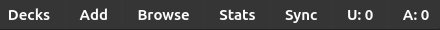

# Changes To Anki

After installing MorphMan you will find that some changes have been made to Anki.

## Toolbar

The toolbar now has two new items, “U: 0" and "A: 0”.

* “U” stands for Known Unique Morphs
* "A" stands for All Known Morphs

For some lanuages U and A will always have the same number, but languages like japanese can have morphs with multiple
variations and then they will eventually differ.

  
 Examples 

<blockquote>

**Each column in the table contains variations of the same morph.**

Knowing the morph in the highlighted cell below would give you U: 1 and A: 1

<table>
    <colgroup>
    <col>
    <col>
    <col>
  </colgroup>
<tr>
    <td>ない</td>
    <td>物</td>
    <td>奴</td>
    <td>出</td>
</tr>
<tr>
    <td>ねぇ</td>
    <td>もの</td>
    <td>やつ</td>
    <td>出る</td>
</tr>
<tr>
    <td>ね</td>
    <td class="morph-variation-selected_cell">もん</td>
    <td>ヤツ</td>
    <td>出よう</td>
</tr>
</table>

Knowing the morphs in the highlighted cells below would give you U: 1 and A: 2

<table>
    <colgroup>
    <col>
    <col>
    <col>
  </colgroup>
<tr>
    <td>ない</td>
    <td class="morph-variation-selected_cell">物</td>
    <td>奴</td>
    <td>出</td>
</tr>
<tr>
    <td>ねぇ</td>
    <td>もの</td>
    <td>やつ</td>
    <td>出る</td>
</tr>
<tr>
    <td>ね</td>
    <td class="morph-variation-selected_cell">もん</td>
    <td>ヤツ</td>
    <td>出よう</td>
</tr>
</table>

Knowing the morphs in the highlighted cells below would give you U: 2 and A: 3

<table>
    <colgroup>
    <col>
    <col>
    <col>
  </colgroup>
<tr>
    <td>ない</td>
    <td class="morph-variation-selected_cell">物</td>
    <td>奴</td>
    <td>出</td>
</tr>
<tr>
    <td>ねぇ</td>
    <td>もの</td>
    <td>やつ</td>
    <td class="morph-variation-selected_cell">出る</td>
</tr>
<tr>
    <td>ね</td>
    <td class="morph-variation-selected_cell">もん</td>
    <td>ヤツ</td>
    <td>出よう</td>
</tr>
</table>

 
</blockquote>

These numbers are updated after every [Recalc](../usage/recalc.md).

## Browse

MorphMan adds new options in the Browse window that can be accessed either from the "Morphman" menu at the top or when
right-clicking cards:

* “View Morphemes”
* “Learn Card Now”
* “Browse Same Morphs”
* “Tag As Known”

These features are explained in [here](../usage/browser.md).

## Tools Menu

A MorphMan menu is added to "Tools" menu and has the options:

* [“Recalc”](../usage/recalc.md)
* [“Preferences”](../setup/preferences.md)
* [“Database Manager”](../usage/database-manager.md)
* [“Readability Analyzer”](../usage/readability-analyzer.md)

## Morph Stats & Graphs

In the "Shift"-click version of the Stats window you can
see [stats ands graphs over your learned morphs](../usage/statistics.md).
