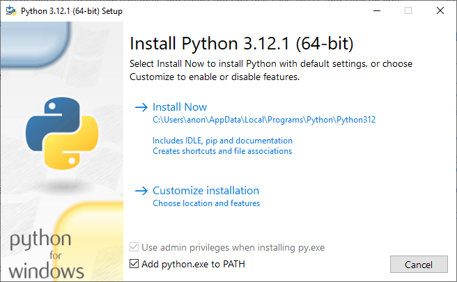

# Choosing spaCy Models

First you need to find out which spaCy model(s) you want to download. A spaCy model determines which language is used and
how
to interpret that language. Find the names of the models you want to use from
the [spaCy website](https://spacy.io/usage/models),
e.g., `en_core_web_sm`.

Note that there are usually four different models to choose from, each with their distinct suffixes:

- sm (small model)
- md (medium model)
- lg (large model)
- trf (transformer model) <span style="color:red">NOT SUPPORTED BY ANKIMORPHS!</span>

Larger models are slower, but they might produce better results.

If you go to the [spaCy website: Language support](https://spacy.io/usage/models#languages) section, you can click on
the packages of a language to see which models are available.

# Installing spaCy

There is, unfortunately, no super simple way to integrate spaCy with Anki, so we have to use perform a little bit of
terminal magic. This is because spaCy has a relatively large size (up to ~400 MB), so it can't be included as part of
AnkiMorphs itself. Another problem is that Anki uses Python 3.9, which is considered an outdated version of python.

To get around these problems, we can create a separate instance of Anki that uses a newer version of python and has
access to spaCy.


<details>
  <summary>Windows</summary>

First, we need to have Python 3.9 or higher installed on our system. Go to the start menu, open a Command Prompt, and
type
in:

```
py --list
```

This will list all the installed Python versions. If your output is not `3.9.x` or higher, then that has to be
installed.


<details>
  <summary>Installing Python</summary>

Go to [python.org/downloads](https://www.python.org/downloads/) and download a `Windows installer (64-bit)`

**Note**: When you start the installer, make sure to select the `Add python.exe to PATH` checkbox at the very bottom:



Install with the default settings ("Install Now").

After the installation, go back to the command prompt and type in `py --list` again. You should now see the new Python
version you installed.
</details>

Now we are ready to install spaCy, spacy models, and Anki (aqt). I have installed Python 3.12, so my example below will
use the `py -3.12` command. I also want to use Korean and Russian, so I'm going to download the spaCy
models `ko_core_news_sm` and `ru_core_news_sm`. In the command prompt I will type:

```bash
py -3.12 -m pip install --upgrade pip virtualenv
py -3.12 -m venv spacyenv
spacyenv\Scripts\activate
py -m pip install --upgrade pip setuptools wheel
py -m pip install --upgrade spacy six aqt[qt6]
py -m spacy download ko_core_news_sm
py -m spacy download ru_core_news_sm
deactivate
```

To run this Anki instance, type the following in the command prompt:

```bash
spacyenv\Scripts\anki.exe
```

Now you should be good to go!
</details>


<details>
  <summary>macOS</summary>

First, we need to have Python 3.9 or higher installed on our system. Open a terminal and type:

```` bash
python --version
````

If your output is not `Python 3.9.x` or higher, then that has to be installed.

<details>
  <summary>Installing Python</summary>

If you already have homebrew installed, then you can install Python easily like this:

```
brew install python@3.12
```

If you don't have have homebrew, then I recommend installing python by going
to [python.org/downloads](https://www.python.org/downloads/) and download
a `macOS 64-bit universal2 installer`, and install with the default recommended settings.

After the installation, open a new terminal and type in `python --version` again. You should now see the new Python
version you installed.
</details>

Now we are ready to install spaCy, spacy models, and Anki (aqt). I have installed Python 3.12, so my example below will
use the `python3.12` command. I also want to use Korean and Russian, so I'm going to download the spaCy
models `ko_core_news_sm` and `ru_core_news_sm`. In the command prompt I will type:

```` bash
python3.12 -m pip install --upgrade pip virtualenv
python3.12 -m venv spacyenv
spacyenv/bin/activate
python -m pip install --upgrade pip setuptools wheel
python -m pip install --upgrade spacy six 'aqt[qt6]'
python -m spacy download ko_core_news_sm
python -m spacy download ru_core_news_sm
deactivate
````

To run Anki, type this in the terminal:

```
open spacyenv/bin/anki
```

Now you should be good to go!
</details>

<details>
  <summary>Linux</summary>

First, we need to have Python 3.9 or higher installed on our system. Open a terminal and type:

```` bash
python --version
````

If your output is not `Python 3.9.x` or higher, then that has to be installed.

<details>
  <summary>Installing Python</summary>

Python can usually be easily installed with package managers, e.g:

```
sudo apt update
sudo apt install python3
```

After the installation, open a new terminal and type in `python --version` again. You should now see the new Python
version you installed.
</details>

Now we are ready to install spaCy, spacy models, and Anki (aqt). I have installed Python 3.12, so my example below will
use the `python3.12` command. I also want to use Korean and Russian, so I'm going to download the spaCy
models `ko_core_news_sm` and `ru_core_news_sm`. In the command prompt I will type:

```` bash
python3.12 -m pip install --upgrade pip virtualenv
python3.12 -m venv spacyenv
spacyenv/bin/activate
python -m pip install --upgrade pip setuptools wheel
python -m pip install --upgrade spacy six aqt[qt6]
python -m spacy download ko_core_news_sm
python -m spacy download ru_core_news_sm
deactivate
````

To run Anki, type this in the terminal:

```
spacyenv/bin/anki
```

Now you should be good to go!
</details>

<br>
<details>
  <summary>Potential problems</summary>

### PowerShell Execution Policy Error


This is a safeguard against running malicious scripts, which is generally a good thing. To allow an exception for this
one time, you can use the command:

````powershell
Set-ExecutionPolicy -ExecutionPolicy Unrestricted -Scope Process
````

If you want to permanently remove this restriction for your user, then use the command:

````powershell
Set-ExecutionPolicy -ExecutionPolicy Unrestricted -Scope CurrentUser
````

</details>