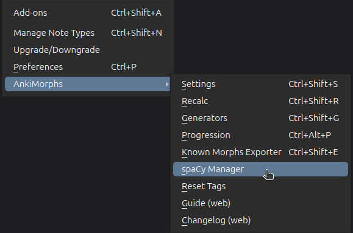
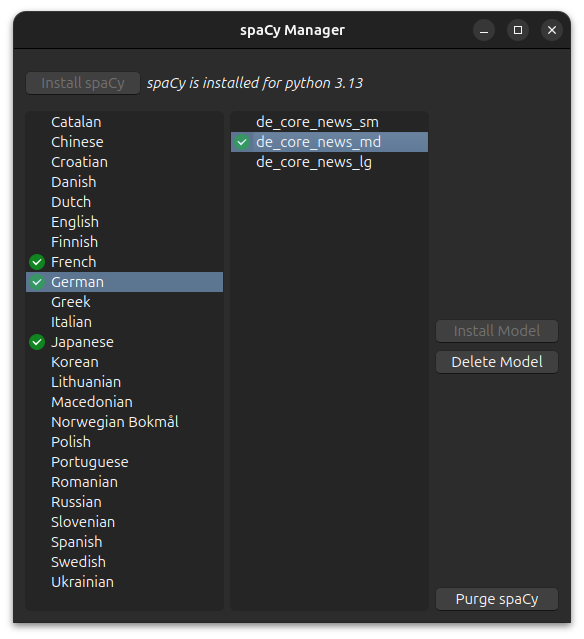

# Installing spaCy

From the Anki `Tools` menu, navigate to `AnkiMorphs` -> `spaCy Manager`

which will take you to the `spaCy manager` window:

* **Installing spaCy**:  
  > **Note**: spaCy is specific to the Python version it was installed for; a version built for Python 3.9 will not work with Python 3.10, and vice versa.
  
  When you click install, spaCy will automatically be downloaded and installed into a dedicated folder 
  (virtual environment), which can be found here:  
  - Windows: `%APPDATA%\Anki2\addons21\spacy-venv-python-<version>`
  - macOS: `~/Library/Application Support/Anki2/addons21/spacy-venv-python-<version>`
  - Linux: `~/.local/share/Anki2/addons21/spacy-venv-python-<version>`

  After the installation is complete you have to restart Anki before you can install any models.

* **Install Model**:  
  > **Note:** The models are stored in the virtual environment folder.

  There are usually three different types of models (morphemizers) to choose from for each language, each with their distinct suffixes:

  - sm (small model): ~10–50 MB
  - md (medium model): ~50–150 MB
  - lg (large model): ~500 MB+
  
  Larger models are slower, but they might produce better results.
  
* **Delete Model**:  
  Deletes the model from the virtual environment folder. 
* **Purge spaCy**  
  Removes the entire virtual environment folder, removing both spaCy and its models.