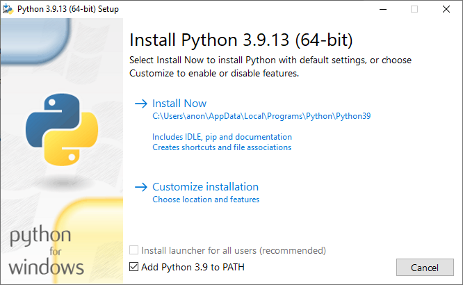
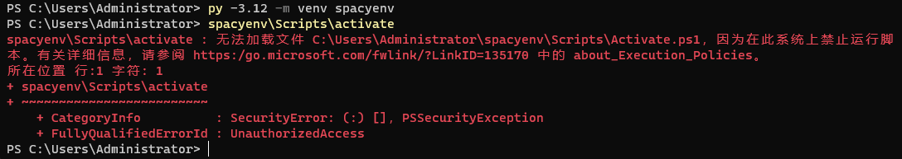

# Choosing spaCy Models

First you need to find out which spaCy model(s) you want to download. A spaCy model determines which language is used
and how to interpret that language. Find the names of the models you want to use from
the [spaCy website](https://spacy.io/usage/models),
e.g., `en_core_web_sm`.

Note that there are usually four different types of models to choose from, each with their distinct suffixes:

- sm (small model)
- md (medium model)
- lg (large model)
- trf (transformer model) <span style="color:red">NOT SUPPORTED BY ANKIMORPHS!</span>

Larger models are slower, but they might produce better results.

If you go to the [spaCy website: Language support](https://spacy.io/usage/models#languages) section, you can click on
the packages of a language to see which models are available.

# Installing spaCy

There is, unfortunately, no super simple way to integrate spaCy with Anki, so we have to perform a little bit of
terminal magic. This is because spaCy has a relatively large size (usually ~400 MB), so it can't be included as part of
AnkiMorphs itself.

Another problem is that we have to install spaCy with the same python version that Anki uses. If you downloaded Anki
from their website, the python version will be `3.9`. This version of python is considered outdated, further complicating
the process somewhat.

If your Anki is from another source, then read the section below:

<details>
  <summary>Non-standard Anki builds</summary>

> **Note:** If you are using a non-standard Anki build (e.g. `anki-bin` from AUR), then the python version will
> probably not be `3.9`. To check which
> python version your Anki is using, go to `Help -> About`, and you will find something like
> this: `Python 3.9.15 Qt 6.6.1 PyQt 6.6.1`
> <br><br>Because of the way the python packaging system works, we have to install spaCy with a python version that has
> the same first two number groups, i.e. if your Anki shows `Python 3.11.xx`, you can install spaCy using
> any `Python 3.11.yy` version.
> <br><br>The rest of this guide assumes Anki uses `Python 3.9`, but if that is not the cause, then substitute `3.9` in
> the terminal commands with whatever your Anki is using.
</details>


With all that being said, this only needs to be done once, so hopefully it's not too bad.


<details>
  <summary>Windows</summary>

First, we need to have `Python 3.9` on our system. Go to the start menu, open a Command Prompt, and type in:

```
py -3.9 --version
```

If your output is not `Python 3.9.x`, then 3.9 has to be installed.

>Note: If you install Python 3.9 in a different way than the instructions below, then you might encounter important 
> differences that could prevent you from accessing the spaCy morphemizers in Anki.

<details>
  <summary>Installing Python</summary>

Go to [https://www.python.org/downloads/release/python-3913/](https://www.python.org/downloads/release/python-3913/) and
download the `Windows installer (64-bit)` at the bottom of the page.

**Note**: When you start the installer, make sure to select the `Add python.exe to PATH` checkbox at the very bottom:



Install with the default settings ("Install Now").

After the installation, go back to the command prompt and type in `py -3.9 --version` again. You should now see the new
Python version you installed.
</details>

Now we are ready to install spaCy and the models you want to use. Paste these commands into the command prompt:

```bash
cd %HOMEPATH%\AppData\Roaming\Anki2\addons21
py -3.9 -m pip install --upgrade pip virtualenv
py -3.9 -m venv spacyenv
spacyenv\Scripts\activate
py -m pip install --upgrade pip setuptools wheel
py -m pip install --upgrade spacy six
```

In the same command prompt, we now want to download the models. Here I'll use the Korean model `ko_core_news_sm` and the
Russian
model `ru_core_news_sm`.

```bash
py -m spacy download ko_core_news_sm
py -m spacy download ru_core_news_sm
deactivate
```

Now those spaCy models should be available as morphemizers in AnkiMorphs!
</details>


<details>
  <summary>macOS</summary>
First, we need to have `Python 3.9` on our system. Go to the start menu, Open a terminal and type:

```` bash
python3.9 --version
````

If your output is not `Python 3.9.x`, then 3.9 has to be installed.

>Note: If you install Python 3.9 in a different way than the instructions below, then you might encounter important
> differences that could prevent you from accessing the spaCy morphemizers in Anki.

<details>
  <summary>Installing Python</summary>

Go to [https://www.python.org/downloads/release/python-3913/](https://www.python.org/downloads/release/python-3913/) and
download the `macOS 64-bit universal2 installer` at the bottom of the page.

Install with the default settings ("Install Now").

After the installation, open a new terminal and type in `python3.9 --version` again. You should now see the new Python
version you installed.
</details>

Now we are ready to install spaCy and the models you want to use. Paste this into the terminal:

```bash
cd ~/Library/Application\ Support/Anki2/addons21
python3.9 -m pip install --upgrade pip virtualenv
python3.9 -m venv spacyenv
. spacyenv/bin/activate
python -m pip install --upgrade pip setuptools wheel
python -m pip install --upgrade spacy six
```

In the same terminal, we now want to download the models. Here I'll use the Korean model `ko_core_news_sm` and the
Russian
model `ru_core_news_sm`.

```bash
python -m spacy download ko_core_news_sm
python -m spacy download ru_core_news_sm
deactivate
```

Now those spaCy models should be available as morphemizers in AnkiMorphs!

</details>

<details>
  <summary>Linux</summary>

First, we need to have `Python 3.9` on our system. Go to the start menu, Open a terminal and type:

```` bash
python3.9 --version
````

If your output is not `Python 3.9.x`, then 3.9 has to be installed.

<details>
  <summary>Installing Python</summary>

This is the hardest part of the installation process because Python 3.9 is considered dead, and it can therefore be
tricky
to download and install.

If you are on a Debian distro you can install it from the deadsnakes PPA:

```bash
sudo apt update
sudo apt install software-properties-common
sudo add-apt-repository ppa:deadsnakes/ppa
sudo apt update
sudo apt install python3.9
sudo apt install python3.9-venv
```

Another alternative that also works on other distros is [pyenv](https://github.com/pyenv/pyenv).

After the installation, open a new terminal and type in `python3.9 --version` again. You should now see the new Python
version you installed.
</details>


Now we are ready to install spaCy and the models you want to use. Open a terminal and `cd` to the addons21 directory,
e.g:

```bash
cd ~/.local/share/Anki2/addons21/
```

Then install spaCy:

```bash
python3.9 -m pip install --upgrade pip virtualenv
python3.9 -m venv spacyenv
source spacyenv/bin/activate
python -m pip install --upgrade pip setuptools wheel
python -m pip install --upgrade spacy six
```

In the same terminal, we now want to download the models. Here I'll use the Korean model `ko_core_news_sm` and the
Russian
model `ru_core_news_sm`.

```bash
python -m spacy download ko_core_news_sm
python -m spacy download ru_core_news_sm
deactivate
```

Now those spaCy models should be available as morphemizers in AnkiMorphs!
</details>

<br>
<details>
  <summary>Potential problems</summary>

### PowerShell Execution Policy Error



This is a safeguard against running malicious scripts, which is generally a good thing. To allow an exception for this
one time, you can use the command:

````powershell
Set-ExecutionPolicy -ExecutionPolicy Unrestricted -Scope Process
````

If you want to permanently remove this restriction for your user, then use the command:

````powershell
Set-ExecutionPolicy -ExecutionPolicy Unrestricted -Scope CurrentUser
````

</details>