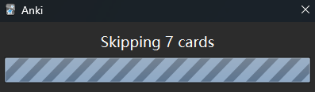
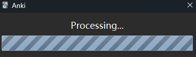
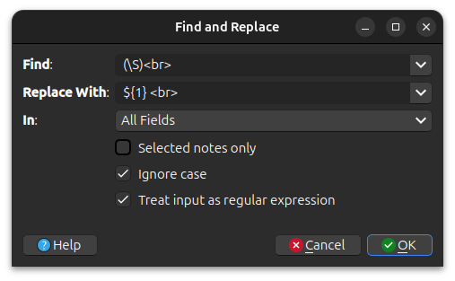
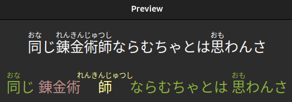
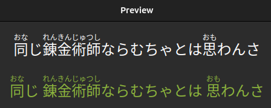
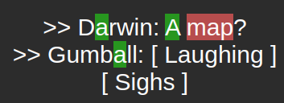

# Known Problems

<details>
  <summary style="display:list-item">Undoing 'set known and skip'</summary>

> There is a bug that occurs when you do the following:
>    1. Open Anki
>    2. Go to a deck and click 'Study Now'
>    3. Only 'set known and skip' cards
        > <br>
>
>  If you do this then those actions cannot be undone immediately.
> You can easily fix this by simply answering (or basically doing anything to) the next card, and you can now just undo
> twice and the previous 'set known and skip' will be undone.
>
>  This is a weird bug, but I suspect it is due to some guards Anki has about not being able to undo something until the
> user has made a change manually first ('set known and skip' only makes changes programmatically).
>
</details>


<details>
  <summary style="display:list-item">Redo is not supported</summary>

> Redoing, i.e. undoing an undo (Ctrl+Shift+Z), is a nightmare to handle with the current Anki API. Since it is a rarely
> used feature, it is not worth the required time and effort to make sure it always works. Redo _might_ work just fine,
> but
> it also might not. Use it at your own risk.
</details>


<details>
  <summary style="display:list-item">Freezing when reviewing</summary>

> AnkiMorphs uses the Anki API to run in the background after you answer a card, which then
> displays a progress bar of how many cards have been skipped:
>
> 
>
> The Anki API has a rare bug where it sometimes gets in a deadlock and just says 'Processing...' forever.
>
> 
>
> When this happens you have to restart Anki.

</details>


<details>
  <summary style="display:list-item">Morphs don't split correctly</summary>

> Anki stores text on cards as HTML, and this can cause some weird/unexpected problems. One such problems is that
> line breaks are actually stored as `<br>`.
>
> Here is how it looks on the card:
>
>```plaintext
>Hello.
>Goodbye.
>```
>
>This is how it is actually stored:
>
>```plaintext
>Hello.<br>Goodbye.
>```
>
>Most morphemizers completely ignore the unicode equivalent of `<br>`, which results in them interpreting the text as:
>
>```plaintext
>Hello.Goodbye.
>```
>
>To fix this problem, we can use the [find and replace feature](https://docs.ankiweb.net/browsing.html#find-and-replace)
> in Anki to add a whitespace between before the `<br>` on all our cards:

> Where the `Find` field has this:
>```plaintext
>(\S)<br>
>```
>The `(\S)` part finds a non-whitespace character and saves it for later.
>
>And then the `Replace With` field has this:
>```plaintext
>${1} <br>
>```
>The `${1}` part re-inserts the `(\S)` character that was found earlier.


</details>


<details>
  <summary style="display:list-item">Ruby characters (furigana, etc.) are displayed wrong in am-highlighted and am-highlight</summary>

> When morphs are not recognized in the same way that the ruby characters intended, then we can get ugly things like this:
>
> 
>
> This is because `錬金術師` gets split into -> `[錬金術, 師]` and the ruby characters are after the second morph, so
> they only attach to that one. Fixing this programmatically is not possible, unfortunately. 
> 
>If you _really_ wanted to
> fix this particular card then you would have to do some manual editing to the ruby characters in the original field,
> e.g. splitting it into two different parts:
> ``` 
> original:
> 錬金術師[れんきんじゅつし]
> 
> split:
> 錬金術[れんきんじゅ]師[つし]
> ```
> then `am-highlighted` will produce this instead:
> 
> 

</details>

</details>


<details>
  <summary style="display:list-item">Incorrect highlighting of ignored names</summary>

> When names are ignored, either by the morphemizer or those found in the `names.txt`, then the highlighting
> is prone to false-positives where other morphs also found in the text can mistakenly get highlighted in the names:
>

</details>

<details>
  <summary style="display:list-item">Readability report freezes indefinitely when input is too long</summary>

> When using the `AnkiMorphs: Japanese` morphemizer, excessively long lines of text can cause the morphemizer's buffer
> to overflow, causing the progress bar to freeze indefinitely. To avoid this, try splitting the long lines into
> shorter segments.

</details>

<details>
  <summary style="display:list-item">Anki crashing when opening AnkiMorphs settings</summary>

> The `AnkiMorphs: Japanese` morphemizer doesn't handle paths with diacritical marks very well, so paths like this:
> `C:\Users\héroïne` can cause crashes. If you can't change the path name that is causing the crash, try using spaCy
> morphemizers instead.

</details>