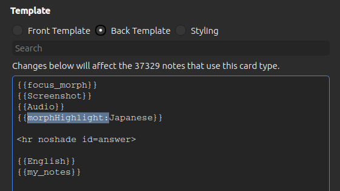

# Highlighting

MorphMan allows for automatic color-coding of morphs based on their learning status (how well you know them). This is
done on the fly by the add-on, so you won't be able to see any highlighting on mobile or ankiweb.

<video autoplay loop muted controls>
    <source src="../../img/highlighting.mp4" type="video/mp4">
</video>


I recommend only putting color-coding on the back of cards. The reason for this is that, in order to get the best
results, you want your SRS experience to simulate real life as much as possible. When reading in real life, you aren’t
going to be told which words you know and which you don’t. So, it makes sense to have your sentence cards reflect this.

To add color-coding go to "Customize Card Template" and add `morphHighlight:` inside of the curly brackets before the
field name.



**Note**: I recommend that you _**don't**_ highlight the focus morph field if you have it on your card. Morphs are
context-dependent therefore isolated morphs might get the wrong highlighting.

Then add the following to the "Styling" section (choose any color you want):

``` css
[mtype=unknown] { color: #f75464; } /* red */
[mtype=unmature] { color: #8bb33d; } /* light-green */
[mtype=mature] { color: green; }
```


It’s also possible to use “background-color” instead of “color”:

``` css
[mtype=unknown] { background-color: #ffff99; } /* yellow */
[mtype=unmature] { background-color: #f2f2f2; } /* gray */
[mtype=mature] { background-color: #b3e6cc; } /* green */
``` 

In order for the color-coding to take effect, you first need to run [Recalc](../usage/recalc.md), which will and have
MorphMan analyze your collection and create the database it will use to color your cards.

### Duplicate Audio Problem


When the back of a card also has an audio field and not just the front, then both might play after each other when you
press "Show Answer". To prevent both playing you can do the following:
1. Go to deck-options
2. Scroll down to the "Audio" section
3. Activate "Skip question when replaying answer"