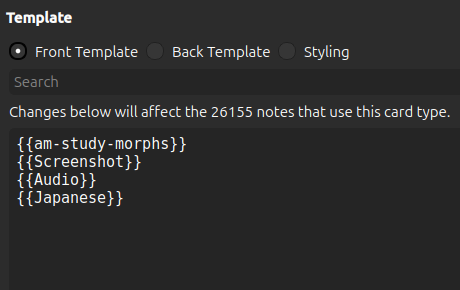
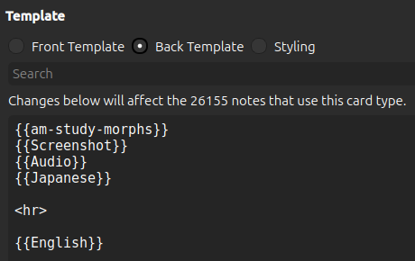
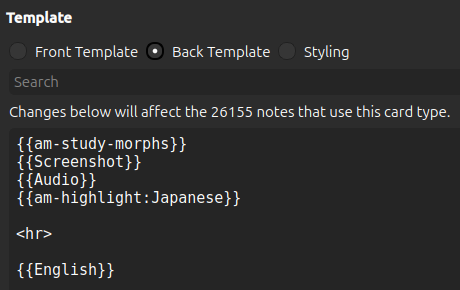
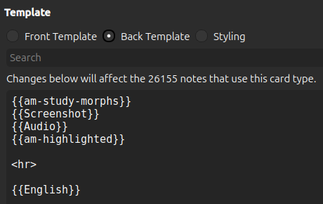
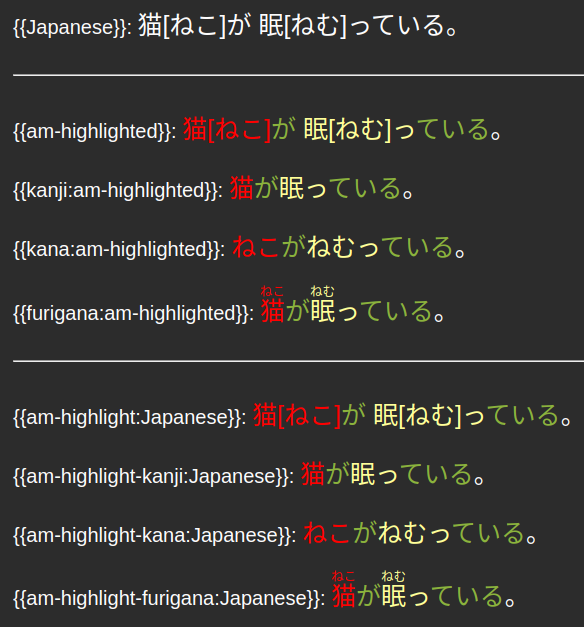

# Highlighting

<video autoplay loop muted controls>
    <source src="../../../img/highlighting.mp4" type="video/mp4">
</video>


AnkiMorphs can automatically color-code morphs based on their learning status, i.e., how well you know them.

I recommend only putting the highlighted-field on the back of cards. The reason for this is that, in order to get the
best
results, you want your SRS experience to simulate real life as much as possible. When reading in real life, you aren’t
going to be told which words you know and which you don’t. So, it makes sense to have your sentence cards reflect this.

The highlighting can be done in two ways, the text can either be **dynamically** highlighted (just-in-time) whenever you encounter it, or by
adding a **static** extra field to your cards that only updates when using [Recalc](../usage/recalc.md).


## Static vs Dynamic

Both options have their tradeoffs, and you should evaluate them before deciding which one to use.

<br>

|                                   | Static | Dynamic |
|-----------------------------------|--------|---------|
| **Works on mobile**               | Yes    | No      |
| **Can make viewing cards slower** | No     | Yes     |
| **Increases collection size**     | Yes    | No      |
| **Increases sync duration**       | Yes    | No      |
| **Requires modifying cards**      | Yes    | No      |
| **Slower Recalc**                 | Yes    | No      |

<br>


For highlighting to work, the cards must [match a note filter](../setup/settings/note-filter.md). However, for
**dynamic** highlighting, the note filter does not need the `read` or `modify` options enabled. This means you can
apply highlighting to cards without sorting them.

For the **static** highlighting to work you have to also enable the [`am-highlighted` extra field](settings/extra-fields.md).

Now we have to update the card templates and styling.

## Changing Your Card Templates

Here is a simplified template of the card shown above without any highlighting:






To add **dynamic** highlighting to the back of the card we prepend `am-highlight:` to the `Japanese` field:


To add **static** highlighting to the back of the card we replace the `Japanese` field with `am-highlighted`



We also need to update the `styling` section to specify which colors we want the morphs to have.

## Changing Your Card Styling


You can pick and choose among these; if you only want unknown morphs to be highlighted, and you don't care about
dark-mode, then only adding the first line would be enough. You can also change the colors to anything you want.


``` css
[morph-status=unknown] { color: blue; }
[morph-status=learning] { color: #8bb33d; } /* light-green */
[morph-status=known] { color: green; }
[morph-status=undefined] { color: grey; }

.nightMode [morph-status=unknown] { color: red; } 
.nightMode [morph-status=learning] { color: #ffff99; } /* yellow */
.nightMode [morph-status=known] { color: #8bb33d; } /* light-green */
.nightMode [morph-status=undefined] { color: grey; }
```


It’s also possible to use `background-color`:

``` css
[morph-status=unknown] { background-color: blue; }
[morph-status=learning] { background-color: #8bb33d; } /* light-green */
[morph-status=known] { background-color: green; }
[morph-status=undefined] { background-color: grey; }

.nightMode [morph-status=unknown] { background-color: red; } 
.nightMode [morph-status=learning] { background-color: #ffff99; } /* yellow */
.nightMode [morph-status=known] { background-color: #8bb33d; } /* light-green */
.nightMode [morph-status=undefined] { background-color: grey; }
```


### Ruby Character Filters 


> **Note**: The `Ignore content in square brackets` [preprocess setting](../setup/settings/preprocess.md) option needs to
> be activated for ruby character highlighting to function properly.

Anki supports [ruby characters](https://docs.ankiweb.net/templates/fields.html#ruby-characters) (pronunciation annotations) such as furigana.
You can choose how these are displayed by prepending the respective [character filter](https://docs.ankiweb.net/templates/fields.html#additional-ruby-character-filters)
to the field on the card template. The native character filters work on the static highlighting, and for the dynamic highlighting
we have corresponding custom filters.


<br>

|                             | Static             | Dynamic                           |
|-----------------------------|--------------------|-----------------------------------|
| **Kanji only**              | `kanji:` | `am-highlight-kanji:`                       |
| **Kana only**               | `kana:` | `am-highlight-kana:`                         |
| **Furigana**                | `furigana:` | `am-highlight-furigana:` |

<br>

Here is an example of what they all look like:




### Duplicate Audio Problem


When the back of a card also has an audio field and not just the front, then both might play after each other when you
press `Show Answer` on the card. To prevent both playing you can do the following:

1. Go to deck-options
2. Scroll down to the `Audio` section
3. Activate `Skip question when replaying answer`