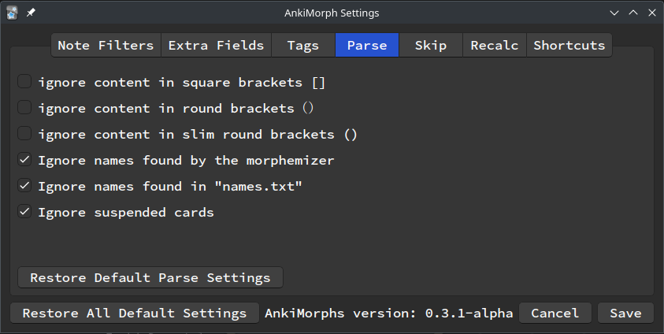
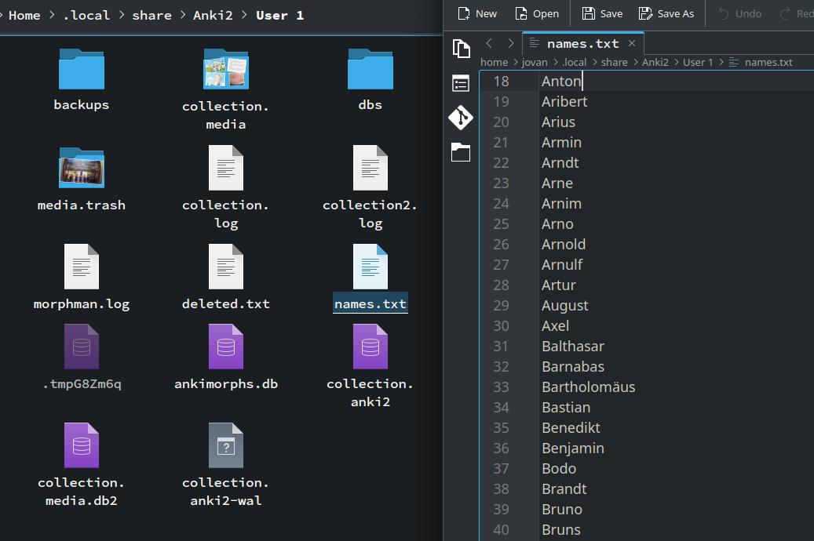

# Names
Ankimorphs includes a functionality that allows users to bypass processing names listed in a file named names.txt. This feature is specifically designed to prevent the misinterpretation of names of places or individuals as unknown, as these words may lack inherent meaning for the user.

To activate this feature, navigate to ``Tool > AnkiMorphs > Settings > Skip > Parse``` and tick the option "Ignore names found in names.txt."


To update the list of names, input a list of names separated by new lines into the names.txt file. The file can be found in different locations based on your operating system:
- For Windows: ``%APPDATA%\Anki2\ProfileName```
- For MacOS: ``~/Library/Application`
- For Linux: ``~/.local/share/Anki2`` or ``$XDG_DATA_HOME/Anki2``


During a review, you can also add names to the list by selecting a word, right-clicking it, and choosing "Mark as name" from the dropdown menu. And the word will automatically be added to names.txt

