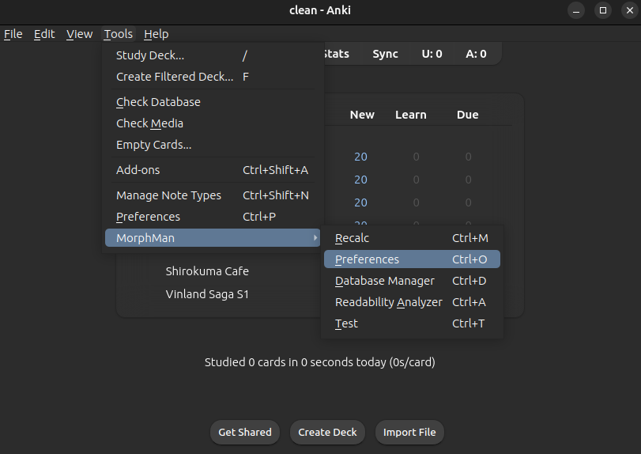

# Preferences

The "Preferences" menu has the following tabs:

* [Note Filter](preferences/note-filter.md) is where you set which cards you want MorphMan to analyze and sort
* [Extra Fields](preferences/extra-fields.md) is where you set the [focus morph](../glossary.md#focus-morph) field
* [Tags](preferences/tags.md) is where you can rename the tags MorphMan uses
* [General](preferences/general.md) is where you set parsing preferences and which cards MorphMan skips