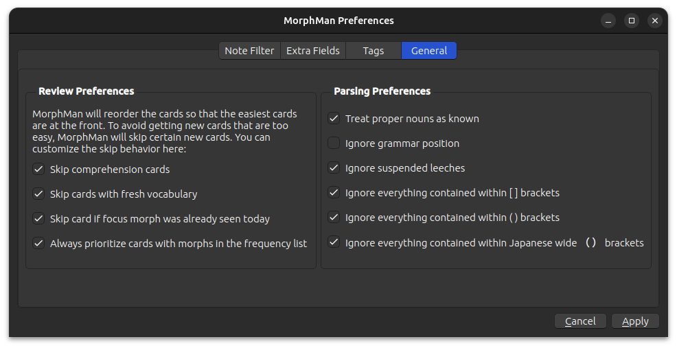

# General

This is where you can make Morphman really efficient. [The MorphMan Index](../../glossary.md#morphman-index-mmi) sorts
your cards based on how well you know its content, the more you know the sooner the card will be shown. The downside is
this is that it might take a long time before you see a cards with any unknown morphs, i.e. you don't learn anything new.

To overcome this problem and speed up the learning process we can check any of the following options:

### Review Preferences

* **Skip comprehension cards**:  
  Cards that only has [mature](../../glossary.md#mature) morphs
* **Skip cards with fresh vocabulary**:  
  Cards that do not contain unknown morphs, but has one or more [unmature](../../glossary.md#unmature) morphs (recently
  learned morphs)
* **Skip card if focus morph was already seen today**:  
  Improves the 'new cards'-queue without having to [recalculate](../../usage/recalc.md) the databases
* **Always prioritize cards with morphs in the frequency list**:  
  Cards with morphs in your [frequency.txt](../prioritizing.md#frequencytxt)
  or [priority.db](../../glossary.md#databases) show first, even if they're not [1T](../../glossary.md#1t-sentence)

### Parsing preferences

* **Treat proper nouns as known**:  
  MorphMan (tries to) ignores nouns
* **Ignore grammar position**:  
  Ignore morpheme grammar types (noun, verb, helper, etc.)
* **Ignore suspended leeches**:  
  Ignore cards that are suspended and have the tag \'leech\'
* **Ignore everything contained within [ ] brackets**:  
  Ignore content such as furigana readings and pitch
* **Ignore everything contained within ( ) brackets**:  
  Ignore content such as character names and readings in scripts
* **Ignore everything contained within Japanese wide （ ） brackets**:  
  Ignore content such as character names and readings in Japanese scripts
