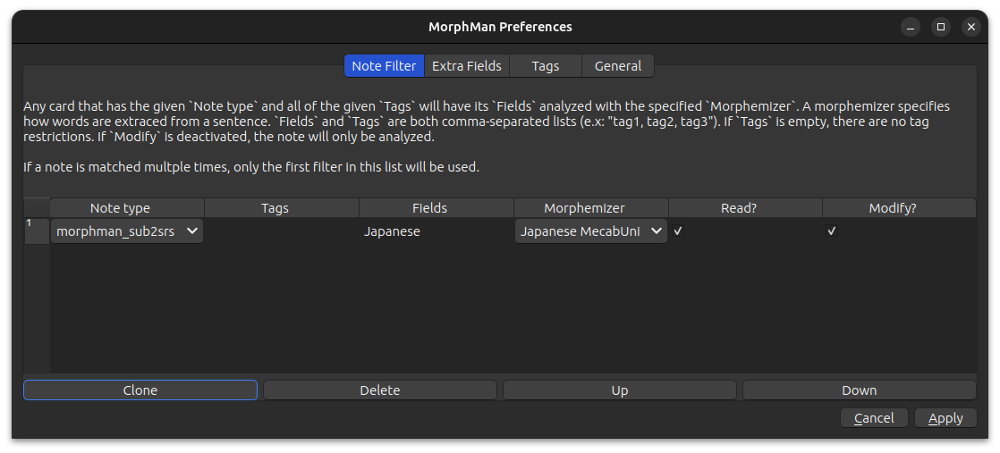

# Note Filter

MorphMan only analyzes and sorts cards that matches at least one "note filter"; if you don't specify any note filters then MorphMan
won't do anything, so this is a necessary step.

Each note filter contains:

* [Note Type](note-filter.md#note-type)
* [Tags](note-filter.md#tags) (optional)
* [Fields](note-filter.md#fields)
* [Morphemizer](note-filter.md#morphemizer)
* [Read & Modify](note-filter.md#read--modify) (optional)

If you have overlapping filters, whichever filter is listed first will take priority (hence the “Up” and “Down”
buttons).

## Note Type

To find a card's note type do the following:

<video autoplay loop muted controls>
    <source src="../../../img/note-type.mp4" type="video/mp4">
</video>

1. Go to Browse
2. Find a card you want MorphMan to analyze and sort
3. Right-click the card
4. Click Info
5. See Note Type

All the cards in my "Japanese Sentences" deck (and sub-decks) have the same note type, but that might not be the case
for your decks.

Another thing you can do is look through the "Note Types" in the left sidebar and until you find the cards you are after.

## Tags
You can further filter MorphMan to only work on cards with a certain note type **and** specific tag(s). Tags are comma-separated, e.g. "tag1, tag2"

## Fields

This is the field on the card MorphMan reads and analyzes, which is then used to sort the card.

1. Go to Browse
2. Find the note type in the left sidebar
3. Find the field you care about

In my case the field I'm interested in is "Japanese" (with a capital J)

Field names are case-sensitive!

## Morphemizer

This is the [parsing dictionary](../../installation/parsing-dictionary.md) MorphMan uses to find morphs.

## Read & Modify

If for whatever reason you don't want MorphMan to read and analyze one of the note filters you have set up then you can
uncheck the "Read?" option.

If you uncheck “Modify?”, MorphMan will analyze the
specified fields of cards (and update the database of learned/mature Morphs based on them), but won’t actually reorder
them.

> **Note**: This can be useful when you want to feed any previous decks you have learned into Morphman. Doing so will
> store your already known morphs to Morphman, potentially saving you some time.

