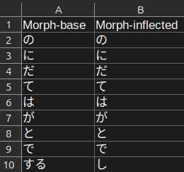

# Prioritizing

The more frequently a morph occurs in a language, the more useful it is to learn. This is the fundamental principle
behind AnkiMorphs--learn a language in the order that will be the most useful.

AnkiMorphs is a general purpose language learning tool, therefore, it has to be told which morphs occur most often. You
can do this in two ways, either have AnkiMorphs calculate the morph frequencies found in your
cards (`Collection frequency`), or you can specify a custom .csv file that contains that information.

## frequency.csv

Your custom .csv file needs to follow this format:

- The first row is assumed to contain column headers and will be ignored.
- Rows 2 and down are assumed to contain morphs in descending order of frequency, i.e., the morph on the second row is
  the most frequently occurring morph, the morph on the third row is the second most frequently occurring, etc.

Keep the files to 50K rows or fewer, any rows after that are ignored. The [algorithm that calculates the difficulty](../usage/recalc.md#difficulty-algorithm) of
cards needs to have a max limit on morph priorities to make it practical, hence this 50K limit.

Any .csv file located in the folder [[anki profile folder](../glossary.md#profile-folder)]`/frequency-files/` is
available for selection in [note filters: morph priority](../setup/settings/note-filter.md#morph-priority).

### Creating Your Own frequency.csv

You can use the [Frequency File Generator](../usage/generators/frequency-file-generator.md) to generate your own frequency.csv
file.

### Downloadable Frequency Files

  
Catalan

> * <a download href="../../frequency_lists/catalan/wortschatz/ca-freq.csv">ca-freq.csv</a>
>   - Source: `cat_news_2022_300K-sentences.txt` found on [wortschatz - catalan corpora](https://wortschatz.uni-leipzig.de/en/download/Catalan)
>   - Morphemizer: `spaCy: ca-core-news-sm`

  
Chinese

> * <a download href="../../frequency_lists/chinese/wortschatz/zh-simplified-freq.csv">zh-simplified-freq.csv</a>
>   - Source: `zho_news_2020_300K-sentences.txt` found on [wortschatz - chinese corpora](https://wortschatz.uni-leipzig.de/en/download/Chinese#zho-simp_news_2010)
>   - Morphemizer: `spaCy: zh-core-web-sm`

  
Croatian

> * <a download href="../../frequency_lists/croatian/wortschatz/hr-freq.csv">hr-freq.csv</a>
>    - Source: `hrv_news_2020_300K-sentences.txt` found on [wortschatz - croatian corpora](https://wortschatz.uni-leipzig.de/en/download/Croatian)
>    - Morphemizer: `spaCy: hr-core-news-sm`

  
Danish

> * <a download href="../../frequency_lists/danish/wortschatz/da-freq.csv">da-freq.csv</a>
>    - Source: `dan_news_2022_300K-sentences.txt` found on [wortschatz - danish corpora](https://wortschatz.uni-leipzig.de/en/download/Danish)
>    - Morphemizer: `spaCy: da-core-news-sm`

  
Dutch

> * <a download href="../../frequency_lists/dutch/wortschatz/nl-freq.csv">nl-freq.csv</a>
>   - Source: `nld_news_2022_300K-sentences.txt` found on [wortschatz - dutch corpora](https://wortschatz.uni-leipzig.de/en/download/Dutch)
>   - Morphemizer: `spaCy: nl-core-news-sm`

  
English

> * <a download href="../../frequency_lists/english/wortschatz/en-wiki-freq.csv">en-wiki-freq.csv</a>
>    - Source: `eng_wikipedia_2016_300K-sentences.txt` found on [wortschatz - english corpora](https://wortschatz.uni-leipzig.de/en/download/English)
>    - Morphemizer: `spaCy: en-core-web-sm`

  
Finnish

> * <a download href="../../frequency_lists/finnish/wortschatz/fi-freq.csv">fi-freq.csv</a>
>    - Source: `fin_news_2022_300K-sentences.txt` found on [wortschatz - finnish corpora](https://wortschatz.uni-leipzig.de/en/download/Finnish)
>    - Morphemizer: `spaCy: fi-core-news-sm`

  
French

> * <a download href="../../frequency_lists/french/wortschatz/fr-freq.csv">fr-freq.csv</a>
>    - Source: `fra_news_2022_300K-sentences.txt` found on [wortschatz - french corpora](https://wortschatz.uni-leipzig.de/en/download/French)
>    - Morphemizer: `spaCy: fr-core-news-sm`

  
German

> * <a download href="../../frequency_lists/german/wortschatz/de-freq.csv">de-freq.csv</a>
>    - Source: `deu_news_2022_300K-sentences.txt` found on [wortschatz - german corpora](https://wortschatz.uni-leipzig.de/en/download/German)
>    - Morphemizer: `spaCy: de-core-news-md`

  
Greek (Modern)

> * <a download href="../../frequency_lists/greek/wortschatz/el-freq.csv">el-freq.csv</a>
>    - Source: `ell_news_2022_300K-sentences.txt` found on [wortschatz - modern greek corpora](https://wortschatz.uni-leipzig.de/en/download/Modern%20Greek)
>    - Morphemizer: `spaCy: el-core-news-sm`

  
Italian

> * <a download href="../../frequency_lists/italian/wortschatz/it-freq.csv">it-freq.csv</a>
>    - Source: `ita_news_2022_300K-sentences.txt` found on [wortschatz - italian corpora](https://wortschatz.uni-leipzig.de/en/download/Italian)
>    - Morphemizer: `spaCy: it-core-news-sm`

  
Japanese

> * <a download href="../../frequency_lists/japanese/wortschatz/ja-freq-mecab.csv">ja-freq-mecab.csv</a>
   >    - Source: `jpn_news_2011_300K-sentences.txt` found on [wortschatz - japanese corpora](https://wortschatz.uni-leipzig.de/en/download/Japanese)
   >    - Morphemizer: `AnkiMorphs: Japanese`
>
> * <a download href="../../frequency_lists/japanese/wortschatz/ja-freq-spacy.csv">ja-freq-spacy.csv</a>
   >    - Source: `jpn_news_2011_300K-sentences.txt` found on [wortschatz - japanese corpora](https://wortschatz.uni-leipzig.de/en/download/Japanese)
   >    - Morphemizer: `spaCy: ja_core_news_sm`
>
> * <a download href="../../frequency_lists/japanese/nanako/ja-freq-anime-mecab.csv">ja-freq-anime-mecab.csv</a>
   >    - Source: [NanakoRaws](https://github.com/kienkzz/NanakoRaws-Anime-Japanese-subtitles)
   >    - Morphemizer: `AnkiMorphs: Japanese`
>
> * <a download href="../../frequency_lists/japanese/nanako/ja-freq-anime-spacy.csv">ja-freq-anime-spacy.csv</a>
   >    - Source: [NanakoRaws](https://github.com/kienkzz/NanakoRaws-Anime-Japanese-subtitles)
   >    - Morphemizer: `spaCy: ja_core_news_sm`

  
Korean

> * <a download href="../../frequency_lists/korean/wortschatz/ko-freq.csv">ko-freq.csv</a>
>    - Source: `kor_news_2022_300K-sentences.txt` found on [wortschatz - korean corpora](https://wortschatz.uni-leipzig.de/en/download/Korean)
>    - Morphemizer: `spaCy: ko-core-news-sm`

  
Lithuanian

> * <a download href="../../frequency_lists/lithuanian/wortschatz/lt-freq.csv">lt-freq.csv</a>
>    - Source: `lit_news_2020_300K-sentences.txt` found on [wortschatz - lithuanian corpora](https://wortschatz.uni-leipzig.de/en/download/Lithuanian)
>    - Morphemizer: `spaCy: lt-core-news-sm`

  
Macedonian

> * <a download href="../../frequency_lists/macedonian/wortschatz/mk-freq.csv">mk-freq.csv</a>
>    - Source: `mkd_newscrawl_2011_300K-sentences.txt` found on [wortschatz - macedonian corpora](https://wortschatz.uni-leipzig.de/en/download/Macedonian)
>    - Morphemizer: `spaCy: mk-core-news-sm`

  
Norwegian (Bokmål)

> * <a download href="../../frequency_lists/norwegian/wortschatz/nb-freq.csv">nb-freq.csv</a>
>    - Source: `nob_news_2013_300K-sentences.txt` found on [wortschatz - norwegian corpora](https://wortschatz.uni-leipzig.de/en/download/Norwegian%20Bokm%C3%A5l)
>    - Morphemizer: `spaCy: nb-core-news-sm`

  
Polish

> * <a download href="../../frequency_lists/polish/wortschatz/pl-freq.csv">pl-freq.csv</a>
>    - Source: `pol_news_2022_300K-sentences.txt` found on [wortschatz - polish corpora](https://wortschatz.uni-leipzig.de/en/download/Polish)
>    - Morphemizer: `spaCy: pl-core-news-sm`

  
Portuguese

> * <a download href="../../frequency_lists/portuguese/wortschatz/pt-freq.csv">pt-freq.csv</a>
>    - Source: `por_news_2022_300K-sentences.txt` found on [wortschatz - portuguese corpora](https://wortschatz.uni-leipzig.de/en/download/Portuguese)
>    - Morphemizer: `spaCy: pt-core-news-sm`

  
Romanian

> * <a download href="../../frequency_lists/romanian/wortschatz/ro-freq.csv">ro-freq.csv</a>
>    - Source: `ron_news_2022_300K-sentences.txt` found on [wortschatz - romanian corpora](https://wortschatz.uni-leipzig.de/en/download/Romanian)
>    - Morphemizer: `spaCy: ro-core-news-sm`

  
Russian

> * <a download href="../../frequency_lists/russian/wortschatz/ru-freq.csv">ru-freq.csv</a>  
>   - Source: `rus-ru_web-public_2019_300K-sentences.txt` found on [wortschatz - russian corpora](https://wortschatz.uni-leipzig.de/en/download/Russian)
>   - Morphemizer: `spaCy: ru-core-news-sm`

  
Slovenian

> * <a download href="../../frequency_lists/slovenian/wortschatz/sl-freq.csv">sl-freq.csv</a>
>    - Source: `slv_news_2020_300K-sentences.txt` found on [wortschatz - slovenian corpora](https://wortschatz.uni-leipzig.de/en/download/Slovenian)
>    - Morphemizer: `spaCy: sl-core-news-sm`

  
Spanish

> * <a download href="../../frequency_lists/spanish/wortschatz/es-freq.csv">es-freq.csv</a>
>    - Source: `spa_news_2022_300K-sentences.txt` found on [wortschatz - spanish corpora](https://wortschatz.uni-leipzig.de/en/download/Spanish)
>    - Morphemizer: `spaCy: es-core-news-sm`

  
Swedish

> * <a download href="../../frequency_lists/swedish/wortschatz/sv-freq.csv">sv-freq.csv</a>
>    - Source: `swe_news_2022_300K-sentences.txt` found on [wortschatz - swedish corpora](https://wortschatz.uni-leipzig.de/en/download/Swedish)
>    - Morphemizer: `spaCy: sv-core-news-sm`

  
Ukrainian

> * <a download href="../../frequency_lists/ukrainian/wortschatz/uk-freq.csv">uk-freq.csv</a>
>    - Source: `ukr_news_2022_300K-sentences.txt` found on [wortschatz - ukrainian corpora](https://wortschatz.uni-leipzig.de/en/download/Ukrainian)
>    - Morphemizer: `spaCy: uk-core-news-sm`

