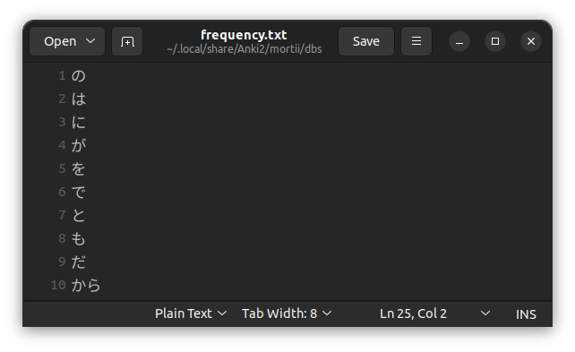

# Prioritizing

Morphman prioritizes morphs based on two things:

* How often the morph occurs in your [specified cards](preferences/note-filter.md#note-filter).
* How high the morph is placed in a manually imported ['frequency.txt'](prioritizing.md#frequencytxt) file.

See the [MorphMan Index section](../glossary.md#morphman-index-mmi) to understand exactly how adding a frequency list
affects MorphMan’s sorting algorithm.

## frequency.txt

This file contains a list of morphs in a top-down format, i.e. the higher the morph is in the list the more frequently
it
occurs. The higher a morph is the more priority it will be given by MorphMan.

Once you place a “frequency.txt” file in
the [database folder](../glossary.md#databases),
MorphMan will automatically begin using it to sort cards next time you run [Recalc](../usage/recalc.md). In order for MorphMan to recognize a
frequency list, it must be formatted as a text file titled “frequency.txt” and contain one morph on each line.

In general, longer frequency lists are preferable, as they provide more coverage. That said, longer frequency lists
might make [Recalc](../usage/recalc.md) take slightly longer to complete.

### Downloadable frequency.txt files

  
Japanese Frequency Lists

> * <a download href="../../frequency_lists/japanese_frequency_lists/jpdb-50k/frequency.txt">jpdb 50k</a> (recommended)  
    Created from jpdb.io's collection of 130 million sentences
> * <a download href="../../frequency_lists/japanese_frequency_lists/netflix-20k/frequency.txt">Netflix 20k</a>  
    Created from all of the Japanese subtitles on Netflix

  
Chinese Frequency List

> * <a download href="../../frequency_lists/chinese_frequency_lists/BLCU-20K/frequency.txt">BLCU 20K</a>  
  Created from the BLCU Chinese Corpus frequency list.

### Creating Your Own frequenxy.txt

You can also use the [Readability Analyzer](../usage/readability-analyzer.md) to generate your own original
frequency.txt from
target-language text.