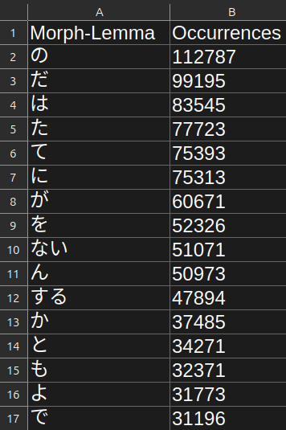
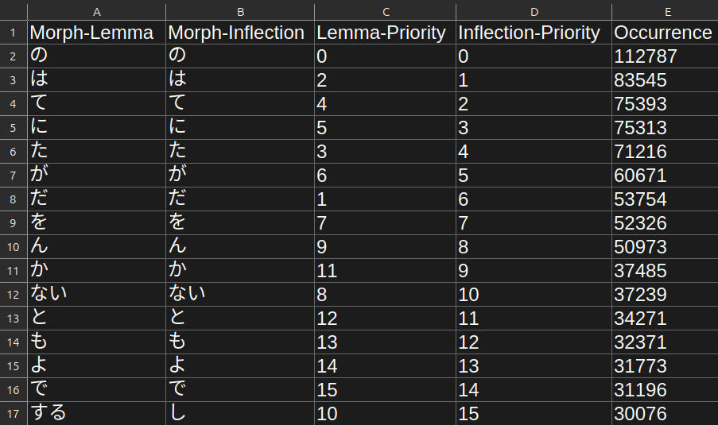

# Prioritizing

The more frequently a morph occurs in a language, the more useful it is to learn. This is the fundamental principle
behind AnkiMorphs--learn a language in the order that will be the most useful.

AnkiMorphs is a general purpose language learning tool, therefore, it has to be told which morphs occur most often. You
can do this in two ways, either have AnkiMorphs calculate the morph frequencies found in your
cards (`Collection frequency`), or you can specify a custom .csv file that contains that information.

Any .csv file located in the folder [[anki profile folder](../glossary.md#profile-folder)]`/priority-files/` is
available for selection in [note filters: morph priority](../setup/settings/note-filter.md#morph-priority).

But before we outline the custom priority files, we have to discuss morph lemmas and inflections.

## Lemmas or Inflections?

There are scenarios where you might not want to give each individual [inflection](../glossary.md#morph) a separate priority:
- Chinese technically does not have inflections, so any inflection data is artificial and leads to a wasteful use of resources.

- Korean has an extreme number of inflections, leading to an explosion of priorities, which creates disproportionate penalties.
- You might feel that you have a good enough grasp of the grammar of inflections, making it unnecessary to prioritize one over another.

If you **_never_** want to give separate priorities to inflections then you should choose a [lemma only priority file](#custom-lemma-priority-files). If
you do care about inflection priorities, or if you might want to switch to lemma priorities on the fly, then choose an [inflection priority file](#custom-inflection-priority-files).


## Custom Priority Files

You can use the [Priority File Generator](../usage/generators.md#priority-file-generator) or the
[Study Plan Generator](../usage/generators.md#study-plan-generator) to create your own custom priority file. 

> **Note**:
> - The `Occurrences` column is optional
> - Any lines after 1 million will be ignored


### Custom Lemma Priority Files


The `lemma only` priority files follows this format:

- **The first row** contains column headers.
- **The second row and down** contain morph lemmas in descending order of frequency.


### Custom Inflection Priority Files


The `inflection` priority files follows this format:

- **The first row** contains column headers.
- **The second row and down** contain morphs in descending order of inflection frequency.
- **The first column** contains morph-lemmas, **the second column** contains morph-inflections (this is done to prevent [morph collisions](#morph-collision)).
- **The third column** contains lemma priorities, **the fourth column** contains inflection priorities (this is done to so you can switch [morph evaluation](../setup/settings/general.md) on the fly).


#### Morph Collision

Inflected morphs can be identical even if they are derived from different lemmas (base), e.g.:

```
Lemma : Inflection
有る    ある
或る    ある
```

To prevent misinterpretation of the inflected morphs, we also store the lemmas.


### Downloadable Priority Files

Unless otherwise stated, these are `inflection` priority files, generated using a 90% comprehension cutoff.


<details>
  <summary>Cantonese</summary>

> **Note**: This is a lemma only priority file that was **not** generated using AnkiMorphs, so it might not work very well (or at all).
> * <a download href="../../priority_files/cantonese/words-hk/zhh-freq.csv">zhh-freq.csv</a>
>   - Source: `existingwordcount.csv` found on [words.hk - analysis](https://words.hk/faiman/analysis/)

</details>

<details>
  <summary>Catalan</summary>

> * <a download href="../../priority_files/catalan/wortschatz/ca-news-priority.csv">ca-news-priority.csv</a>
>   - Source: `cat_news_2022_300K-sentences.txt` found on [wortschatz - catalan corpora](https://wortschatz.uni-leipzig.de/en/download/Catalan)
>   - Morphemizer: `AnkiMorphs: Chinese`

</details>

<details>
  <summary>Chinese</summary>

> **Note**: this is a lemma only priority file.
> * <a download href="../../priority_files/chinese/wortschatz/zh-news-lemma-priority.csv">zh-news-lemma-priority.csv</a>
>   - Source: `zho_news_2020_300K-sentences.txt` found on [wortschatz - chinese corpora](https://wortschatz.uni-leipzig.de/en/download/Chinese#zho-simp_news_2010)
>   - Morphemizer: `spaCy: zh-core-web-sm`

</details>

<details>
  <summary>Croatian</summary>

> * <a download href="../../priority_files/croatian/wortschatz/hr-news-priority.csv">hr-news-priority.csv</a>
>    - Source: `hrv_news_2020_300K-sentences.txt` found on [wortschatz - croatian corpora](https://wortschatz.uni-leipzig.de/en/download/Croatian)
>    - Morphemizer: `spaCy: hr-core-news-sm`

</details>

<details>
  <summary>Danish</summary>

> * <a download href="../../priority_files/danish/wortschatz/da-news-priority.csv">da-news-priority.csv</a>
>    - Source: `dan_news_2022_300K-sentences.txt` found on [wortschatz - danish corpora](https://wortschatz.uni-leipzig.de/en/download/Danish)
>    - Morphemizer: `spaCy: da-core-news-sm`

</details>

<details>
  <summary>Dutch</summary>

> * <a download href="../../priority_files/dutch/wortschatz/nl-news-priority.csv">nl-news-priority.csv</a>
>   - Source: `nld_news_2022_300K-sentences.txt` found on [wortschatz - dutch corpora](https://wortschatz.uni-leipzig.de/en/download/Dutch)
>   - Morphemizer: `spaCy: nl-core-news-sm`

</details>

<details>
  <summary>English</summary>

> * <a download href="../../priority_files/english/wortschatz/en-wiki-priority.csv">en-wiki-priority.csv</a>
>    - Source: `eng_wikipedia_2016_300K-sentences.txt` found on [wortschatz - english corpora](https://wortschatz.uni-leipzig.de/en/download/English)
>    - Morphemizer: `spaCy: en-core-web-sm`

</details>

<details>
  <summary>Finnish</summary>

> * <a download href="../../priority_files/finnish/wortschatz/fi-news-priority.csv">fi-news-priority.csv</a>
>    - Source: `fin_news_2022_300K-sentences.txt` found on [wortschatz - finnish corpora](https://wortschatz.uni-leipzig.de/en/download/Finnish)
>    - Morphemizer: `spaCy: fi-core-news-sm`

</details>

<details>
  <summary>French</summary>

> * <a download href="../../priority_files/french/wortschatz/fr-news-priority.csv">fr-news-priority.csv</a>
>    - Source: `fra_news_2022_300K-sentences.txt` found on [wortschatz - french corpora](https://wortschatz.uni-leipzig.de/en/download/French)
>    - Morphemizer: `spaCy: fr-core-news-sm`

</details>

<details>
  <summary>German</summary>

> * <a download href="../../priority_files/german/wortschatz/de-news-priority.csv">de-news-priority.csv</a>
>    - Source: `deu_news_2022_300K-sentences.txt` found on [wortschatz - german corpora](https://wortschatz.uni-leipzig.de/en/download/German)
>    - Morphemizer: `spaCy: de-core-news-md`

</details>

<details>
  <summary>Greek (Modern)</summary>

> * <a download href="../../priority_files/greek/wortschatz/el-news-priority.csv">el-news-priority.csv</a>
>    - Source: `ell_news_2022_300K-sentences.txt` found on [wortschatz - modern greek corpora](https://wortschatz.uni-leipzig.de/en/download/Modern%20Greek)
>    - Morphemizer: `spaCy: el-core-news-sm`

</details>

<details>
  <summary>Italian</summary>

> * <a download href="../../priority_files/italian/wortschatz/it-news-priority.csv">it-news-priority.csv</a>
>    - Source: `ita_news_2022_300K-sentences.txt` found on [wortschatz - italian corpora](https://wortschatz.uni-leipzig.de/en/download/Italian)
>    - Morphemizer: `spaCy: it-core-news-sm`

</details>

<details>
  <summary>Japanese</summary>

> * <a download href="../../priority_files/japanese/wortschatz/ja-news-priority.csv">ja-news-priority.csv</a>
>    - Source: `jpn_news_2011_300K-sentences.txt` found on [wortschatz - japanese corpora](https://wortschatz.uni-leipzig.de/en/download/Japanese)
>    - Morphemizer: `AnkiMorphs: Japanese`
> * <a download href="../../priority_files/japanese/nanako/ja-anime-priority.csv">ja-anime-priority.csv</a>
>    - Source: [NanakoRaws](https://github.com/kienkzz/NanakoRaws-Anime-Japanese-subtitles)
>    - Morphemizer: `AnkiMorphs: Japanese`
>


</details>

<details>
  <summary>Korean</summary>

> **Note**: this is a lemma only priority file.
>* <a download href="../../priority_files/korean/wortschatz/ko-news-lemma-priority.csv">ko-news-lemma-priority.csv</a>
>    - Source: `kor_news_2022_300K-sentences.txt` found on [wortschatz - korean corpora](https://wortschatz.uni-leipzig.de/en/download/Korean)
>    - Morphemizer: `spaCy: ko-core-news-sm`

</details>

<details>
  <summary>Lithuanian</summary>

> * <a download href="../../priority_files/lithuanian/wortschatz/lt-news-priority.csv">lt-news-priority.csv</a>
>    - Source: `lit_news_2020_300K-sentences.txt` found on [wortschatz - lithuanian corpora](https://wortschatz.uni-leipzig.de/en/download/Lithuanian)
>    - Morphemizer: `spaCy: lt-core-news-sm`

</details>

<details>
  <summary>Macedonian</summary>

> * <a download href="../../priority_files/macedonian/wortschatz/mk-news-priority.csv">mk-news-priority.csv</a>
>    - Source: `mkd_newscrawl_2011_300K-sentences.txt` found on [wortschatz - macedonian corpora](https://wortschatz.uni-leipzig.de/en/download/Macedonian)
>    - Morphemizer: `spaCy: mk-core-news-sm`

</details>

<details>
  <summary>Norwegian (Bokmål)</summary>

> * <a download href="../../priority_files/norwegian/wortschatz/nb-news-priority.csv">nb-news-priority.csv</a>
>    - Source: `nob_news_2013_300K-sentences.txt` found on [wortschatz - norwegian corpora](https://wortschatz.uni-leipzig.de/en/download/Norwegian%20Bokm%C3%A5l)
>    - Morphemizer: `spaCy: nb-core-news-sm`

</details>

<details>
  <summary>Polish</summary>

> * <a download href="../../priority_files/polish/wortschatz/pl-news-priority.csv">pl-news-priority.csv</a>
>    - Source: `pol_news_2022_300K-sentences.txt` found on [wortschatz - polish corpora](https://wortschatz.uni-leipzig.de/en/download/Polish)
>    - Morphemizer: `spaCy: pl-core-news-sm`

</details>

<details>
  <summary>Portuguese</summary>

> * <a download href="../../priority_files/portuguese/wortschatz/pt-news-priority.csv">pt-news-priority.csv</a>
>    - Source: `por_news_2022_300K-sentences.txt` found on [wortschatz - portuguese corpora](https://wortschatz.uni-leipzig.de/en/download/Portuguese)
>    - Morphemizer: `spaCy: pt-core-news-sm`

</details>

<details>
  <summary>Romanian</summary>

> * <a download href="../../priority_files/romanian/wortschatz/ro-news-priority.csv">ro-news-priority.csv</a>
>    - Source: `ron_news_2022_300K-sentences.txt` found on [wortschatz - romanian corpora](https://wortschatz.uni-leipzig.de/en/download/Romanian)
>    - Morphemizer: `spaCy: ro-core-news-sm`

</details>

<details>
  <summary>Russian</summary>

> * <a download href="../../priority_files/russian/wortschatz/ru-web-priority.csv">ru-web-priority.csv</a>
>   - Source: `rus-ru_web-public_2019_300K-sentences.txt` found on [wortschatz - russian corpora](https://wortschatz.uni-leipzig.de/en/download/Russian)
>   - Morphemizer: `spaCy: ru-core-news-sm`

</details>

<details>
  <summary>Slovenian</summary>

> * <a download href="../../priority_files/slovenian/wortschatz/sl-news-priority.csv">sl-news-priority.csv</a>
>    - Source: `slv_news_2020_300K-sentences.txt` found on [wortschatz - slovenian corpora](https://wortschatz.uni-leipzig.de/en/download/Slovenian)
>    - Morphemizer: `spaCy: sl-core-news-sm`

</details>

<details>
  <summary>Spanish</summary>

> * <a download href="../../priority_files/spanish/wortschatz/es-news-priority.csv">es-news-priority.csv</a>
>    - Source: `spa_news_2022_300K-sentences.txt` found on [wortschatz - spanish corpora](https://wortschatz.uni-leipzig.de/en/download/Spanish)
>    - Morphemizer: `spaCy: es-core-news-sm`

</details>

<details>
  <summary>Swedish</summary>

> * <a download href="../../priority_files/swedish/wortschatz/sv-news-priority.csv">sv-news-priority.csv</a>
>    - Source: `swe_news_2022_300K-sentences.txt` found on [wortschatz - swedish corpora](https://wortschatz.uni-leipzig.de/en/download/Swedish)
>    - Morphemizer: `spaCy: sv-core-news-sm`

</details>

<details>
  <summary>Ukrainian</summary>

> * <a download href="../../priority_files/ukrainian/wortschatz/uk-news-priority.csv">uk-news-priority.csv</a>
>    - Source: `ukr_news_2022_300K-sentences.txt` found on [wortschatz - ukrainian corpora](https://wortschatz.uni-leipzig.de/en/download/Ukrainian)
>    - Morphemizer: `spaCy: uk-core-news-sm`

</details>