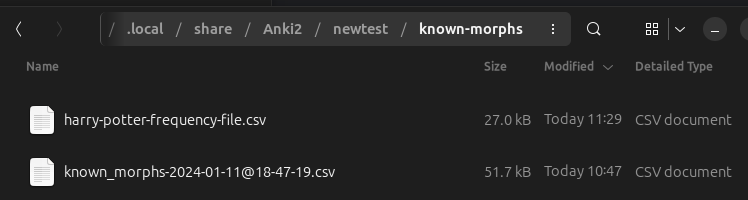

# Setting Known Morphs

AnkiMorphs determines which morphs you know based on the cards it reads. One problem with this approach is that
information can get lost when you delete cards. To overcome this problem, you can store known morphs in .csv files in the
[[anki profile](../glossary.md#profile-folder)]`/known-morphs` folder.

Any .csv file that has the same format as those created by
the [frequency file generator](../usage/generators/frequency-file-generator.md), and
the [known morphs exporter](../usage/known-morphs-exporter.md) and is placed in
this folder can be read during [Recalc](../usage/recalc.md) and saved to the database.

You can activate this feature by selecting `Read files in 'known-morphs' folder and register morphs as known` 
in [recalc settings](../setup/settings/recalc.md).