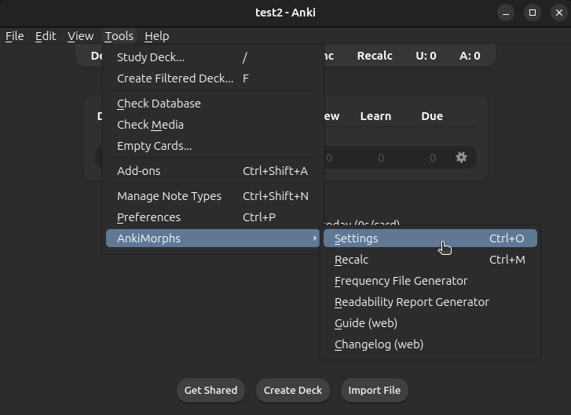

# Settings

To display the settings dialog either use "Ctrl+O" or go to Tools -> AnkiMorphs -> Settings

In settings you will find:

* [Note Filter](settings/note-filter.md) is where you set which cards you want AnkiMorphs to analyze and sort
* [Extra Fields](settings/extra-fields.md) is where you have AnkiMorphs add extra information to your cards
* [Tags](settings/tags.md) is where you can rename the tags AnkiMorphs uses
* [Preprocess](settings/preprocess.md) is where you can adjust the text AnkiMorphs analyzes  
* [Skip](settings/skip.md) is where you adjust which cards AnkiMorphs skips
* [Recalc](settings/recalc.md) is where you adjust recalc
* [Shortcuts](settings/shortcuts.md) is where you adjust keyboard shortcuts