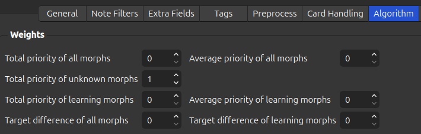

# Algorithm

For these settings to make sense you have to read the [scoring algorithm](../../../user_guide/usage/recalc.md#scoring-algorithm)
section first.

**Weights**:

* **Total priority of all morphs**:  
  The $$\large W_{\text{total}}^{\text{all}}$$ weight in [$$\mathbf{W_P}$$](../../../user_guide/usage/recalc.md#insignificance)

* **Total priority of unknown morphs**:  
  The $$\large W_{\text{total}}^{\text{unknown}}$$ weight in [$$\mathbf{W_P}$$](../../../user_guide/usage/recalc.md#insignificance)
* **Total priority of learning morphs**:  
  The $$\large W_{\text{total}}^{\text{learning}}$$ weight in [$$\mathbf{W_P}$$](../../../user_guide/usage/recalc.md#insignificance)
* **Target difference of all morphs**:  
  The $$\large W_{\text{target}}^{\text{all}}$$ weight in [$$\mathbf{W_D}$$](../../../user_guide/usage/recalc.md#deviation)
* **Average priority of all morphs**:  
  The $$\large W_{\text{average}}^{\text{all}}$$ weight in [$$\mathbf{W_P}$$](../../../user_guide/usage/recalc.md#insignificance)
* **Average priority of learning morphs**:  
  The $$\large W_{\text{average}}^{\text{learning}}$$ weight in [$$\mathbf{W_P}$$](../../../user_guide/usage/recalc.md#insignificance)
* **Target difference of learning morphs**:  
  The $$\large W_{\text{target}}^{\text{learning}}$$ weight in [$$\mathbf{W_D}$$](../../../user_guide/usage/recalc.md#deviation)

 

**Morph Targets**:

These are explained in the [scoring algorithm: deviation](../../../user_guide/usage/recalc.md#deviation) section.

Play around with the variables here: [https://www.geogebra.org/graphing/ta3eqb8y](https://www.geogebra.org/graphing/ta3eqb8y)

This is what the default $$\large D_{\text{target}}^{\text{all}}$$ looks like:

 

And the default $$\large D_{\text{target}}^{\text{learning}}$$ looks like this:

## Sorting Cards in the Exact Same Order as a Priority File

If you only want to sort the cards based on the order of a priority file, disable all the
weights except for $$W_{\text{total}}^{\text{unknown}}$$. This can be especially useful
if you are using a [study plan](https://mortii.github.io/anki-morphs/user_guide/usage/generators.html#study-plan-generator).

