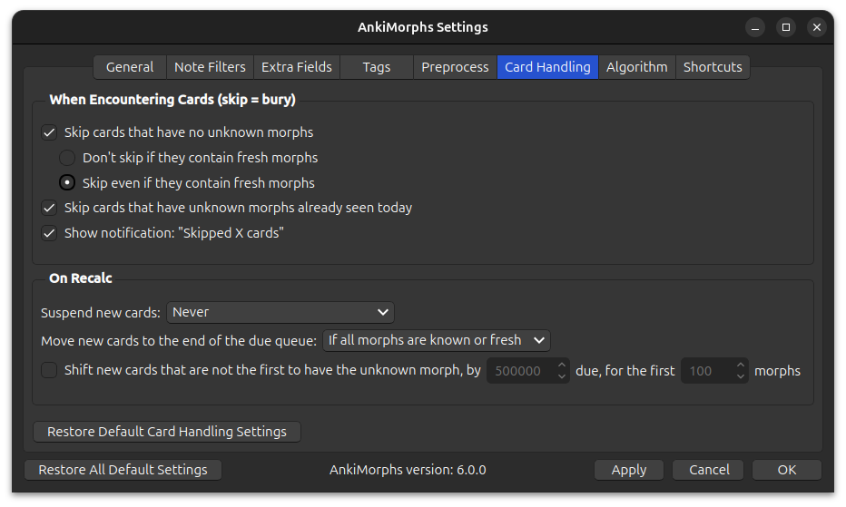

# Card Handling

**Encountering cards during study session**:

This is where you can make AnkiMorphs really efficient. AnkiMorphs sorts
your cards based on how well you know its content; the more you know, the sooner the card will be shown. The downside is
this is that it might take a long time before you see a cards with any unknown morphs, i.e., you don't learn anything
new.

To overcome this problem and speed up the learning process, we can use the options found here.

* **Skip cards with only known morphs**:  
  If AnkiMorph has determined that you know all the morphs on the card, then it will be buried and skipped.
* **Skip cards that have unknown morphs already seen today**:  
  If you have already studied a card earlier today with the same unknown morph, then any subsequent cards with that
  unknown morph will be buried and skipped. This option is beneficial because it means you don't have
  to [Recalc](../../usage/recalc.md) as often.
* **Show "skipped x cards" notification**:  
  After cards are skipped, a notification in the lower left corner displays how many cards were skipped and for what
  reason. If you don't want to see this notification, you can uncheck this option.

  

**On recalc**:
* **Suspend new cards with only known morphs**:  
  Cards that have either the ['All morphs known' tag](tags.md) or the ['Set known and skip' tag](tags.md) will be
  suspended on Recalc.

* **Shift new cards that are not the first to have the unknown morph**:  
  This option is an alternative to the [skip options](skip.md) that are only available on desktop, potentially making it
  easier to study new cards on mobile.  
   There are two parameters you can adjust:
    * How much to shift/offset the due of the affected cards
    * How many unknown morphs to perform this shift/offset on

   Here is an example card order **without** this option activated:
  

  <table>
  <tr>
      <th style="text-align: center">Card ID</th>
      <th style="text-align: center">Unknown Morph</th>
      <th style="text-align: center">Due</th>
  </tr>
  <tr>
      <td>Card_1</td>
      <td style="text-align: center">break</td>
      <td>50 001</td>
  </tr>
  <tr>
      <td class="morph-variation-selected_cell">Card_2</td>
      <td class="morph-variation-selected_cell" style="text-align: center">break</td>
      <td class="morph-variation-selected_cell">50 002</td>
  </tr>
  <tr>
      <td>Card_3</td>
      <td style="text-align: center">walk</td>
      <td>50 003</td>
  </tr>
    <tr>
      <td class="morph-variation-selected_cell">Card_4</td>
      <td class="morph-variation-selected_cell" style="text-align: center">walk</td>
      <td class="morph-variation-selected_cell">50 004</td>
  </tr>
  </table>
  

   Here are the same cards but with this option activated (due_shift = 50 000, first_morphs = 2):
  

  <table>
  <tr>
      <th style="text-align: center">Card ID</th>
      <th style="text-align: center">Unknown Morph</th>
      <th style="text-align: center">Due</th>
  </tr>
  <tr>
      <td>Card_1</td>
      <td style="text-align: center">break</td>
      <td>50 001</td>
  </tr>
  <tr>
      <td>Card_3</td>
      <td style="text-align: center">walk</td>
      <td>50 003</td>
  </tr>
    <tr>
      <td class="morph-variation-selected_cell">Card_2</td>
      <td class="morph-variation-selected_cell" style="text-align: center">break</td>
      <td class="morph-variation-selected_cell">100 002</td>
  </tr>
    <tr>
      <td class="morph-variation-selected_cell">Card_4</td>
      <td class="morph-variation-selected_cell" style="text-align: center">walk</td>
      <td class="morph-variation-selected_cell">100 004</td>
  </tr>
  </table>
  

   

* **Move new cards without unknown morphs to the end of the due queue**:  
  New cards that do not contain any unknown morphs will be given a `due` value of `2047483647` which is the max score given by AnkiMorphs.