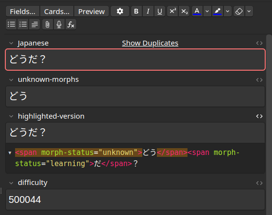

# Extra Fields

> **CAUTION!** Create a backup of your cards before you change selected fields. The content of the selected fields are
> overwritten every [Recalc](../usage/recalc.md). Make sure you don't accidentally select a
> field that has data you care about.

These are potentially destructive options, and they might not do what you think they do at first glance, so be extra
careful. What happens here is the following:

The text found in the `note filter: field` is extracted and analyzed by AnkiMorphs. AnkiMorphs can then place
information about that text into dedicated fields on your cards. Here are what the options produce:

- **Unknowns**: a list of the morphs that are still unknown to you that was found in the text
- **Highlighted**: an HTML version of the text that [highlights](../highlighting.md) the morphs based on learning status
- **Difficulty**: the difficulty AnkiMorphs calculated the text to have

All of these are completely optional, you can leave them to be `(none)` and AnkiMorphs will work just fine. 

Here is an example (the `note filter: field` is `Japanese`):

## Adding A Field To Your Cards

<video autoplay loop muted controls>
    <source src="../../../img/add-field.mp4" type="video/mp4">
</video>

1. Go to Browse
2. Find the note type in the left sidebar
3. Click "Fields..." on the right side
4. Click "Add"
5. Name the field
6. Click "Save"