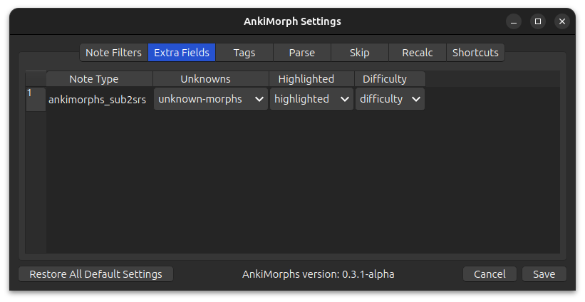
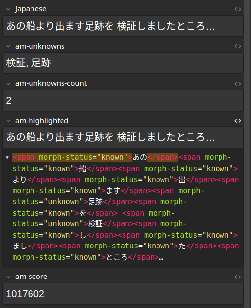
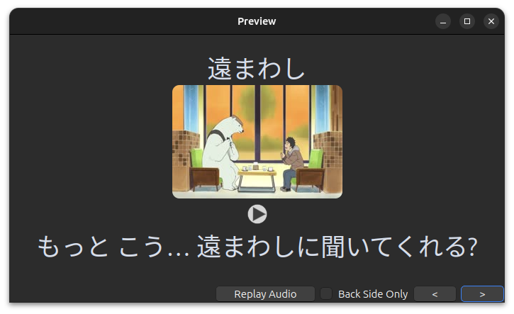
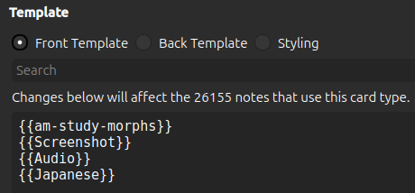
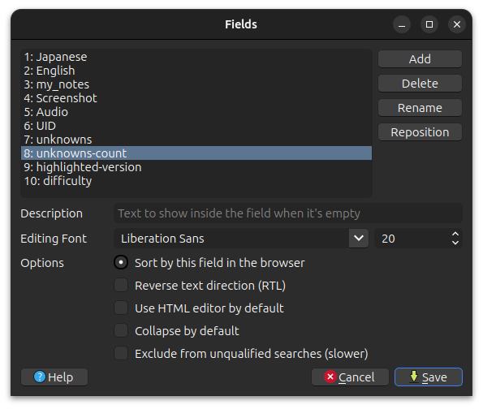
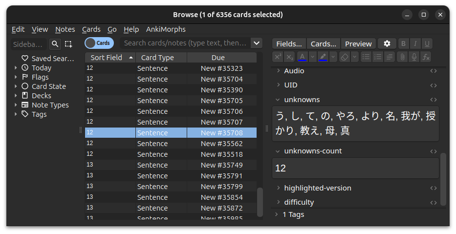
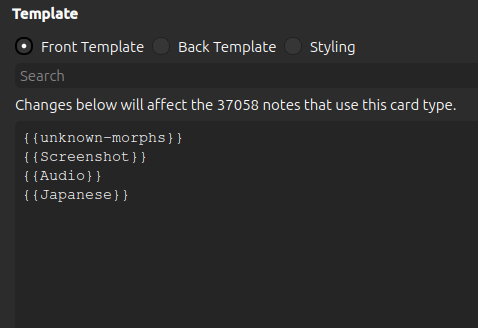
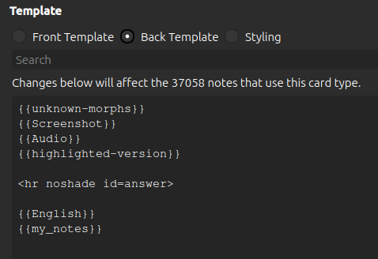
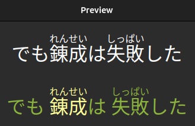
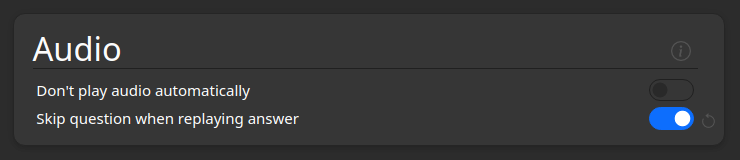

# Extra Fields




The text found in the [note filter: field](../settings/note-filter.md#field) is extracted and analyzed by AnkiMorphs.
AnkiMorphs can then place
information about that text into dedicated fields on your cards.

Here’s a streamlined version that improves clarity and readability:

> **Note**: The first time you select an extra field, you will need to perform a full sync upload to AnkiWeb. If you
> have a large number of cards (500K+), syncing might become an issue. For more details, refer to 
> the [Anki FAQ](https://faqs.ankiweb.net/are-there-limits-on-file-sizes-on-ankiweb.html).

> **Important**: Extra fields add more data to your collection, so only select the fields that will be useful to you.

The fields contain the following:

- **am-all-morphs**:  
  A list of the morphs.

- **am-all-morphs-count**:  
  The number of morphs.
- **am-unknown-morphs**:  
  A list of the morphs that are still unknown to you.
- **am-unknown-morphs-count**:  
  The number of morphs that are still unknown to you.
- **am-highlighted**:  
  An HTML version of the text that highlights the morphs based on learning status.
- **am-score**:  
  The [score](../../usage/recalc.md#scoring-algorithm) AnkiMorphs determined the card to have
- **am-score-terms**:  
  The individual [score](../../usage/recalc.md#scoring-algorithm) terms
- **am-study-morphs**:  
  A list of the morphs that were unknown to you when you first studied the card.


The following fields will only update on [new cards](../../glossary.md#new-cards):
- am-all-morphs
- am-all-morphs-count
- am-score
- am-score-terms
- am-study-morphs

and these fields will always update, even on [reviewed cards](../../glossary.md#reviewed-cards):
- am-unknown-morphs
- am-unknown-morphs-count
- am-highlighted


<br>
Here is an example card where all the extra-fields have been selected:



<br>

**The extra fields display morphs in this form**:

You can chose to display morphs in their inflected forms:
   ``` text
  "walking and talking" -> [walking, and, talking]
   ```

or their lemma (base) forms:
  ``` text
  "walking and talking" -> [walk, and, talk]
  ```

This effects the following three fields:
- am-all-morphs
- am-study-morphs
- am-unknown-morphs


## Using am-study-morphs



Adding this field to your card-template can give you a quick way to see which morphs are/were unknown to you on the first encounter.
Here is a simplified version of the card template used in the example above:




## Using am-*-morphs-count

This is useful if you want to sort your cards in the browser based on how many total/unknown morphs they have.





## Using am-highlighted

<video autoplay loop muted controls>
    <source src="../../../img/highlighting.mp4" type="video/mp4">
</video>

AnkiMorphs can automatically color-code morphs based on their learning status, i.e., how well you know them.

I recommend only putting the highlighted-field on the back of cards. The reason for this is that, in order to get the
best
results, you want your SRS experience to simulate real life as much as possible. When reading in real life, you aren’t
going to be told which words you know and which you don’t. So, it makes sense to have your sentence cards reflect this.

Here is a simplified example of some of the changes you need to make to your card template to get the results shown
above. Notice that the `am-highlighted`-field is substituted for the `Japanese`-field on the back of the card.





You also need to add the following to the `Styling` section (choose any color you want):

``` css
[morph-status=unknown] { color: blue; }
[morph-status=learning] { color: #8bb33d; } /* light-green */
[morph-status=known] { color: green; }

.nightMode [morph-status=unknown] { color: red; } 
.nightMode [morph-status=learning] { color: #ffff99; } /* yellow */
.nightMode [morph-status=known] { color: #8bb33d; } /* light-green */
```

You can pick and choose among these; if you only want unknown morphs to be highlighted, and you don't care about
dark-mode, then only adding the first line would be enough.

It’s also possible to use `background-color`:

``` css
[morph-status=unknown] { background-color: #f7867e; } /* red */
[morph-status=learning] { background-color: #ffff99; } /* yellow */
[morph-status=known] { background-color: #49f53e; } /* green */

.nightMode [morph-status=unknown] { background-color: #b74d4d; } /* red */
.nightMode [morph-status=learning] { background-color: #ccad50; } /* yellow */
.nightMode [morph-status=known] { background-color: #27961f; } /* green */
```


### Furigana and other ruby characters



The `am-highlighted` field supports [ruby characters](https://docs.ankiweb.net/templates/fields.html#ruby-characters)
such as furigana. To have furigana displayed properly, you have to prepend `furigana:` to the field in the card
template, e.g:

``` text
{{furigana:am-highlighted}}
```

You also have to have the `Ignore content in square brackets` [preprocess setting](preprocess.md) activated.

> **Note**: This does not always work flawlessly. The [known problems](../../known-problems.md) section has more
details on how to fix ruby character highlighting problems.

### Duplicate Audio Problem



When the back of a card also has an audio field and not just the front, then both might play after each other when you
press `Show Answer` on the card. To prevent both playing you can do the following:

1. Go to deck-options
2. Scroll down to the `Audio` section
3. Activate `Skip question when replaying answer`

