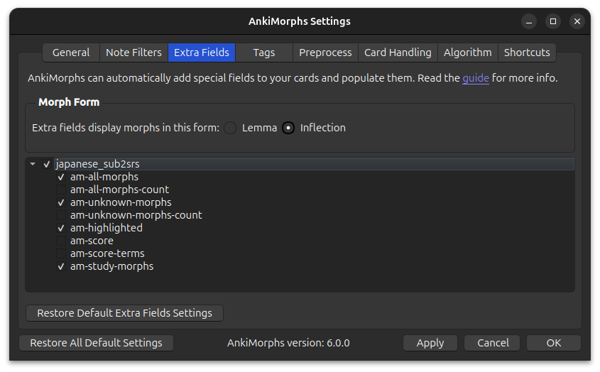

# Extra Fields

> **CAUTION!** Create a backup of your cards before you change selected fields. The content of the selected fields are
> overwritten every [Recalc](../usage/recalc.md). Make sure you don't accidentally select a
> field that has data you care about!



These are potentially destructive options, and they might not do what you think they do at first glance, so be extra
careful. What happens here is the following:

The text found in the [note filter: field](../settings/note-filter.md#field) is extracted and analyzed by AnkiMorphs. AnkiMorphs can then place
information about that text into dedicated fields on your cards. Here are what the options produce:

- **Unknowns**: a list of the morphs that are still unknown to you that was found in the text
- **Highlighted**: an HTML version of the text that highlights the morphs based on learning status
- **Difficulty**: the difficulty AnkiMorphs calculated the text to have

All of these are completely optional, you can leave them to be `(none)` and AnkiMorphs will work just fine.

## Adding Extra Fields To Your Cards

<video autoplay loop muted controls>
    <source src="../../../img/adding-extra-fields.mp4" type="video/mp4">
</video>

1. Go to Browse
2. Find the note type in the left sidebar
3. Click "Fields..." on the right side
4. Click "Add"
5. Name the field
6. Click "Save"

## Using Unknowns


Adding this field to your card-template can give you a quick way to see which morphs are unknown to you. The example
above uses the following card-template:


## Using Highlighted

<video autoplay loop muted controls>
    <source src="../../../img/highlighting.mp4" type="video/mp4">
</video>

AnkiMorphs can automatically color-code morphs based on their learning status, i.e., how well you know them.

I recommend only putting the highlighted-field on the back of cards. The reason for this is that, in order to get the
best
results, you want your SRS experience to simulate real life as much as possible. When reading in real life, you aren’t
going to be told which words you know and which you don’t. So, it makes sense to have your sentence cards reflect this.

Here is a simplified example of some of the changes you need to make to your card template to get the results shown
above. Notice that the `highlighted-version`-field is substituted for the `Japanese`-field on the back of the card.


You also need to add the following to the "Styling" section (choose any color you want):

``` css
[morph-status=unknown] { color: #f75464; } /* red */
[morph-status=learning] { color: #8bb33d; } /* light-green */
[morph-status=known] { color: green; }
```
You don't have to add all three, if you only want the unknown morphs to be highlighted then just add the first line.

It’s also possible to use “background-color”:

``` css
[morph-status=unknown] { background-color: #ffff99; } /* yellow */
[morph-status=learning] { background-color: #f2f2f2; } /* gray */
[morph-status=known] { background-color: #b3e6cc; } /* green */
```


### Duplicate Audio Problem


When the back of a card also has an audio field and not just the front, then both might play after each other when you
press "Show Answer". To prevent both playing you can do the following:

1. Go to deck-options
2. Scroll down to the "Audio" section
3. Activate "Skip question when replaying answer"

## Using Difficulty

This field is really just for debugging purposes, so I recommend that you **don't** add this field to your card-template
to make it visible--it would just end up making your cards more cluttered.