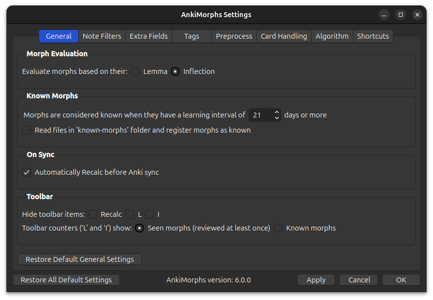

# General

## Morph Evaluation

* **Evaluate morphs based on their lemma or inflection**:  
  This impacts the two things:
  * [scoring algorithm](../../usage/recalc.md#scoring-algorithm): use the [morph priority](../prioritizing.md) associated with the [inflection or the lemma](../../glossary.md#morph).
  * [skipping](card_handling.md): skip morphs based on their lemma or inflection.

## Known Morphs

* **Morphs are considered known when [...]**:  
  This is variable is used when text is [highlighted](../../setup/settings/extra-fields.md#using-am-highlighted), and it
  determines the [L and I numbers](../../installation/changes-to-anki.md#toolbar).

* **Use FSRS card stability instead of card interval for known threshold**:  
  By default, AnkiMorphs determines whether a morph is "known" based on the card’s review interval (how many days until
  you next see the card). With this option enabled, it instead uses the
  [**FSRS stability**](https://faqs.ankiweb.net/what-spaced-repetition-algorithm.html#fsrs) value: how many days it will
  take for the card to go from 100% retrievability to 90% retrievability.
  
  This is very useful if you have decks or presets with different desired retention (DR) thresholds. For example,
  two cards may be "known" equally well, but differences in DR and individualized FSRS parameters
  can cause significant card interval discrepancies:

  | Card  | Deck DR | Interval | Stability |
  | ----- | ------- | -------- | --------- |
  | Card1 | 95%     | 10d      | 30d       |
  | Card2 | 80%     | 50d      | 30d       |

  This interval discrepancy can cause misleading "known" values for morphs. Using stability avoids this problem, since it
  reflects actual memory strength independent of DR.

  > **Note**: make sure you have FSRS enabled when using this option

* **Read files in 'known-morphs' folder and register morphs as known**:  
  Import known morphs from the `known-morphs` folder. Read more in [Settings Known Morphs](../setting-known-morphs.md).

## On Sync

* **Automatically Recalc before Anki sync**:  
  Recalc automatically runs before Anki syncs your card collection.
  > **Note**: If you use the [FSRS4Anki Helper add-on](https://ankiweb.net/shared/info/759844606) with an `Auto [...]
  after sync`-option enabled, then this can cause a bug where sync and recalc occurs simultaneously.

## Toolbar

* **Hide toolbar items:**:  
  If you want to declutter the toolbar you can choose to hide any of the
  [toolbar items](../../installation/changes-to-anki.md#toolbar) provided by the addon.

* **Toolbar counter ('L' and 'I') shows**:  
    * **Seen morphs**:  
      Shows all morphs that have been reviewed at least once. This can be more motivating than only seeing known morphs
      since it goes up every time you study new cards, but it can also give you a false sense of confidence.

    * **Known morphs**:  
      Only show known morphs, which is determined by `Morphs are considered known when [...]` option in the [general setting](general.md).
