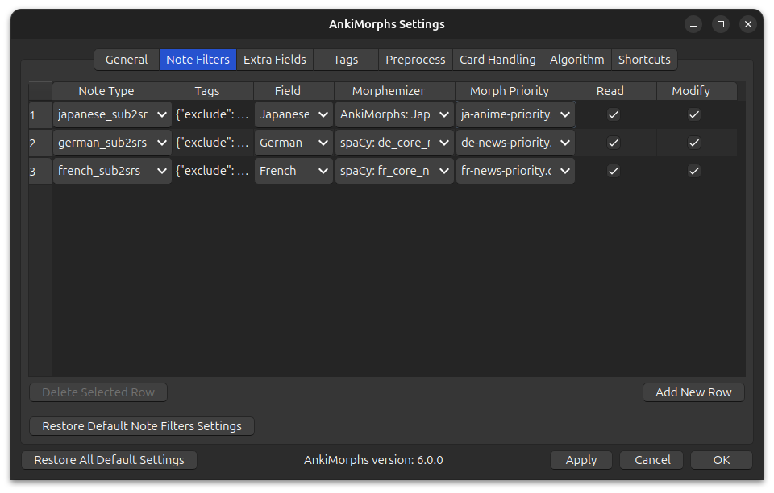
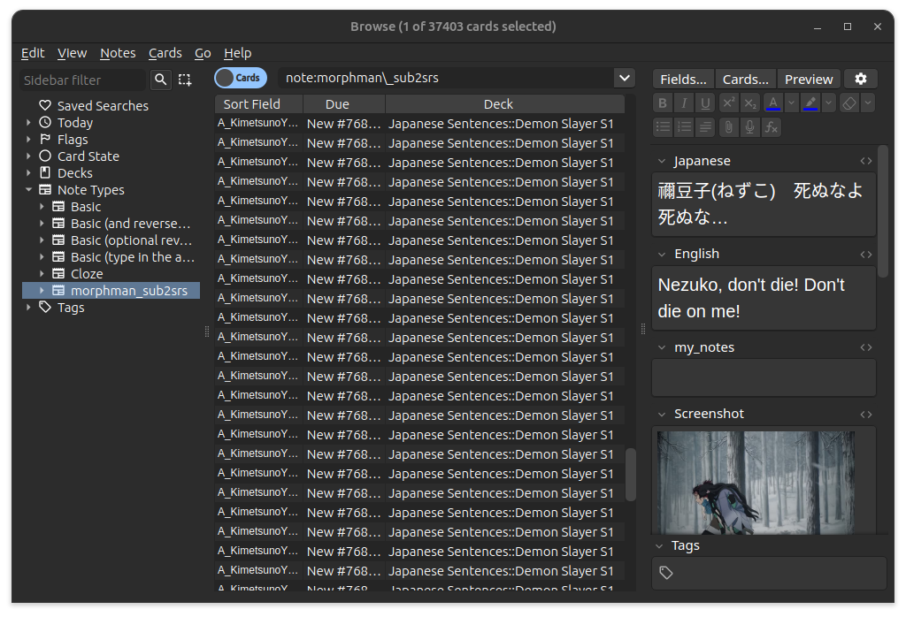
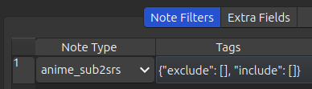
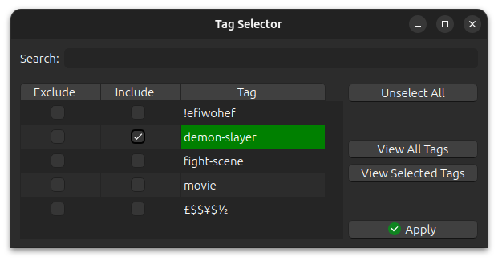
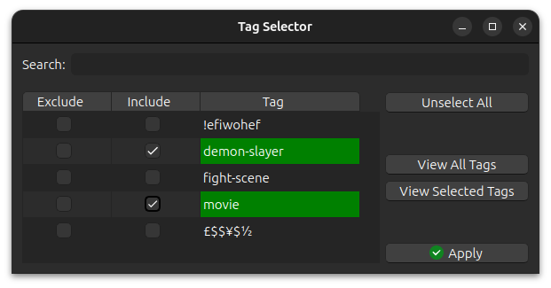
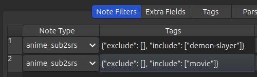
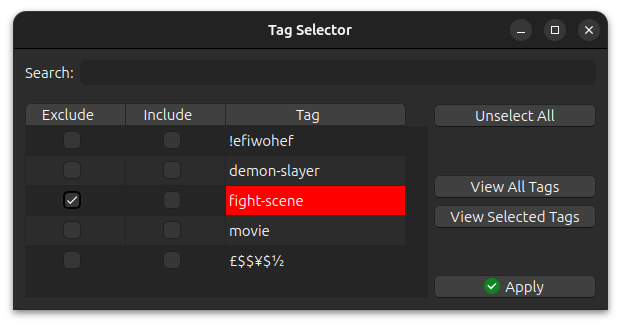
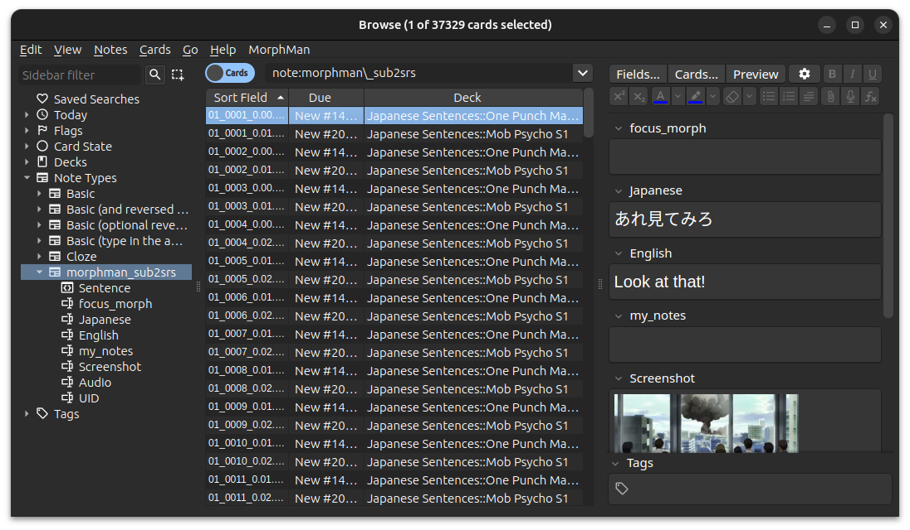
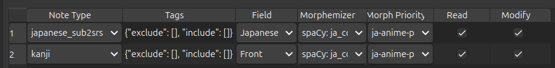
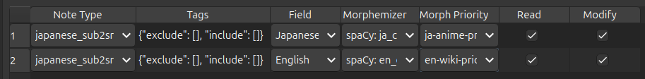

# Note Filter

AnkiMorphs only analyzes and sorts cards that matches at least one "note filter"; if you don't specify any note filters
then AnkiMorphs won't do anything, so this is a necessary step. This can seem overly complicated and overwhelming, but
hopefully things will make sense after reading to the end of this page. This is really the heart of the add-on, and it
has some powerful options (notably [tags](note-filter.md#tags)), so having a good understanding of note filters work
might significantly improve how much you benefit from AnkiMorphs.

Each note filter contains:

* [Note Type](note-filter.md#note-type)
* [Tags](note-filter.md#tags) (optional)
* [Field](note-filter.md#field)
* [Morphemizer](note-filter.md#morphemizer)
* [Morph Priority](note-filter.md#morph-priority)
* [Read & Modify](note-filter.md#read--modify) (optional)

## Note Type

To find a card's note type do the following:

<video autoplay loop muted controls>
    <source src="../../../img/note-type.mp4" type="video/mp4">
</video>

1. Go to Browse
2. Find a card you want AnkiMorphs to analyze and sort
3. Right-click the card
4. Click Info
5. See Note Type

All the cards in my `Japanese Sentences` deck (and sub-decks) have the same note type, but that might not be the case
for your decks.

Another thing you can do is look through the `Note Types` in the left sidebar and until you find the cards you are
after.

## Tags

You can further filter AnkiMorphs to only work on cards with a certain note type **and** with/without specific tag(s).

Let's use an example of having a note type: `anime_sub2srs`. The card break-down of the note type is the following:

- Total cards: 20K
- Cards with the tag `demon-slayer`: 6k
- Cards with the tag `movie`: 3k
- Cards with the tag `fight-scene`: 2k
- Cards that have **both** `demon-slayer` and `movie` tags: 1k

If you want all the 20K cards of note type `anime_sub2srs` then leave the tags empty (default):

If you want the 6K cards with the `demon-slayer` tag:

If you want the 1k cards that have **both** `demon-slayer` and `movie` tags, i.e. the intersection:

If you want the 8K cards that have **either** `demon-slayer` or `movie` tags, i.e. the union, then you have to create
two note-filters like this:

If you want the 18K cards that don't have the `fight-scene` tag:

## Field

This is the field on the card AnkiMorphs reads and analyzes, which is then used to sort the card.

1. Go to Browse
2. Find the note type in the left sidebar
3. Find the field you care about

In my case the field I'm interested in is `Japanese`

## Morphemizer

This is the [parsing dictionary](../../installation/parsing-dictionary.md) AnkiMorphs uses to find morphs.

## Morph Priority

The calculated difficulty of the card, and as a result, the sorting of the card, depends on
the [priority](../prioritizing.md) you give the morphs. You can either set the priorities to be `Collection frequency` (
how often the morphs occur in your card collection), or you could use
a [custom .csv file](../prioritizing.md#frequencycsv) that specifies the priorities of the
morphs.

AnkiMorphs automatically finds .csv files placed
in [[anki profile folder](../../glossary.md#profile-folder)]`/frequency-files/`.

> **Note:** using 'Collection frequency' is not recommended because it is more volatile; if you make any changes to your
> cards (delete, suspend, move, etc.), then that might cause a cascade of sorting changes.

## Read & Modify

If for whatever reason you don't want AnkiMorphs to read one of the note filters you have set up then you
can uncheck the "Read" option.

If you uncheck “Modify”, AnkiMorphs will analyze the
specified fields of cards (and update the database of learned/mature Morphs based on them), but won’t actually reorder
or change the cards in any way.

 
 

# Usage

There are some nuances that are important to be aware of when it comes to note filters:

### Order of the note filters

Order matters. In the image above all the cards that have note type `ankimorphs_sub2srs` will have the text found in
the `Japanese` field analyzed, and then those cards will be sorted based on
the difficulty of that text.

**After those cards are analyzed and sorted** then the next note filter will take effect: All the cards that have the
note type `Kanji` will have the text found in the `Front` field analyzed and then those cards will be sorted based on
the difficulty of that text.

### Overlapping filters

If a card matches multiple filters then it will **only** be analyzed and sorted based on the **first matching filter**.
Any subsequent filters will skip analyzing and sorting the card.

If you were to do something like this:

Then the 2nd filter would do nothing because all the cards would have already been used by the 1st filter.

If you find yourself in a situation where you have overlapping note filters then there are two things you can do:

- Make the filters more restrictive by using [tags](#tags)
- Create a new note type.

> **Tip:** All your cards should
> follow [the minimum information principle](https://supermemo.guru/wiki/Minimum_information_principle), not only will
> that help you remember them better, but it might make the note filters less complicated.