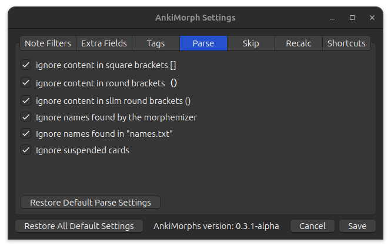

# Parse

It can be useful to pre-process the text on the cards before AnkiMorphs analyzes it.

* **Ignore content in square brackets []**:  
  Ignore content such as furigana readings and pitch
* **Ignore content in round brackets ()**:  
  Ignore content such as character names and readings in scripts
* **Ignore content in slim round brackets（ ）**:  
  Ignore content such as character names and readings in Japanese scripts
* **Ignore names found by the morphemizer**:  
  Some morphemizers are able to recognize some names
* **Ignore names found in "names.txt"**:  
  Ignore names that are placed in [names.txt](../names.md)
* **Ignore suspended cards**:  
  Ignore text found in suspended cards