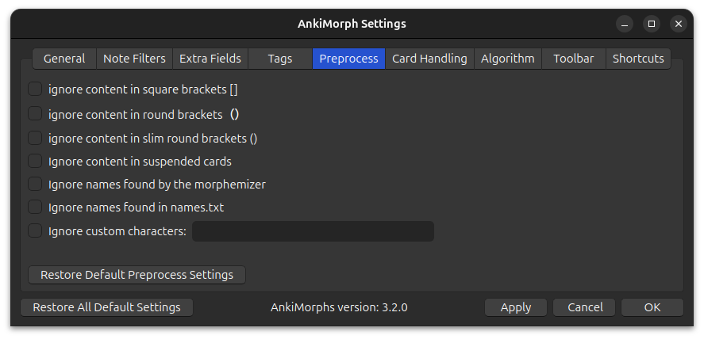

# Preprocess

Here are some options that can preprocess the text on your cards, potentially removing uninteresting morphs for you.

* **Ignore content in square brackets []**:  
  Ignore content such as furigana readings and pitch

* **Ignore content in round brackets ()**:  
  Ignore content such as character names and readings in scripts
* **Ignore content in slim round brackets（ ）**:  
  Ignore content such as character names and readings in Japanese scripts
* **Ignore content in suspended cards**:  
  Ignore text found in suspended cards **_EXCEPT_** for suspended cards that have the [Set known and skip tag](tags.md).
  This exception makes it so that you can safely suspend cards with known morphs without AnkiMorphs losing track of
  which morphs you know.
  > **Note:** if you use [collection frequency](note-filter.md#morph-priority) in any note filters, then you should not
  use this option because it will affect the morph priorities.
* **Ignore names found by the morphemizer**:  
  Some morphemizers are able to recognize some names.
  > **Note:** This can have mixed results; some morphemizers produce a non-trivial amount of false-positives, the German
  spaCy models in particular. If you find that there are missing morphs, then this is the likely cause. In that case you
  are probably better off only using the [names.txt](../names.md) feature.
* **Ignore names found in names.txt**:  
  Ignore names that are placed in [names.txt](../names.md)
