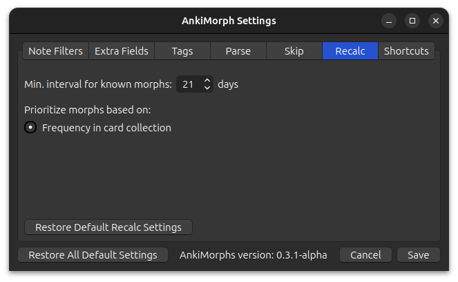

# Recalc



* **Automatically Recalc before Anki sync**:  
  Recalc automatically runs before Anki syncs your card collection.
  > **Note**: If you use the [FSRS4Anki Helper add-on](https://ankiweb.net/shared/info/759844606) with an `Auto [...]
  after sync`-option enabled, then this can cause a bug where sync and recalc occur at the same time.

* **Suspend new cards with only known morphs**:  
  Cards that have either the ['All morphs known' tag](tags.md) or the ['Set known and skip' tag](tags.md) will be
  suspended on Recalc.
* **Read files in 'known-morphs' folder and register morphs as known**:  
  Import known morphs from the known-morphs folder. Read more in [Settings Known Morphs](../setting-known-morphs.md).
* **Move new cards without unknown morphs to the end of the due queue**:  
  New cards that do not contain any unknown morphs will be given a `due` value of `2047483647` which is the max score given by AnkiMorphs.
* **Shift new cards that are not the first to have the unknown morph**:  
  This option is an alternative to the [skip options](skip.md) that are only available on desktop, potentially making it
  easier to study new cards on mobile.  
  <br>There are two parameters you can adjust:
    * How much to shift/offset the due of the affected cards
    * How many unknown morphs to perform this shift/offset on

  <br>Here is an example card order **without** this option activated:
  <div class='morph-variation'>
  <table>
  <tr>
      <th style="text-align: center">Card ID</th>
      <th style="text-align: center">Unknown Morph</th>
      <th style="text-align: center">Due</th>
  </tr>
  <tr>
      <td>Card_1</td>
      <td style="text-align: center">break</td>
      <td>50 001</td>
  </tr>
  <tr>
      <td class="morph-variation-selected_cell">Card_2</td>
      <td class="morph-variation-selected_cell" style="text-align: center">break</td>
      <td class="morph-variation-selected_cell">50 002</td>
  </tr>
  <tr>
      <td>Card_3</td>
      <td style="text-align: center">walk</td>
      <td>50 003</td>
  </tr>
    <tr>
      <td class="morph-variation-selected_cell">Card_4</td>
      <td class="morph-variation-selected_cell" style="text-align: center">walk</td>
      <td class="morph-variation-selected_cell">50 004</td>
  </tr>
  </table>
  </div>

  <br>Here are the same cards but with this option activated (due_shift = 50 000, first_morphs = 2):
  <div class='morph-variation'>
  <table>
  <tr>
      <th style="text-align: center">Card ID</th>
      <th style="text-align: center">Unknown Morph</th>
      <th style="text-align: center">Due</th>
  </tr>
  <tr>
      <td>Card_1</td>
      <td style="text-align: center">break</td>
      <td>50 001</td>
  </tr>
  <tr>
      <td>Card_3</td>
      <td style="text-align: center">walk</td>
      <td>50 003</td>
  </tr>
    <tr>
      <td class="morph-variation-selected_cell">Card_2</td>
      <td class="morph-variation-selected_cell" style="text-align: center">break</td>
      <td class="morph-variation-selected_cell">100 002</td>
  </tr>
    <tr>
      <td class="morph-variation-selected_cell">Card_4</td>
      <td class="morph-variation-selected_cell" style="text-align: center">walk</td>
      <td class="morph-variation-selected_cell">100 004</td>
  </tr>
  </table>
  </div>
  <br>

* **Learning interval of known morphs**:  
  This is variable is used when text is [highlighted](../../setup/settings/extra-fields.md#using-am-highlighted), and it
  can determine [U and A numbers](../../installation/changes-to-anki.md#toolbar).
* **U and A shows seen morphs**:  
  [U and A](../../installation/changes-to-anki.md#toolbar) shows all morphs that have been reviewed at least once. This
  can be more motivating than
  only seeing known morphs since it goes up every time you study new cards, but it can also give you a false sense of
  confidence.
* **U and A shows known morphs**:  
  [U and A](../../installation/changes-to-anki.md#toolbar) only show known morphs (uses
  the `Learning interval of known morphs` setting above).
* **am-unknowns field shows morph inflections**:  
  The [Extra Field](../../setup/settings/extra-fields.md#using-am-unknowns) `am-unknowns` shows morphs in their
  inflected forms.
   ``` text
  "walking and talking" -> [walking, and, talking]
   ```
* **am-unknowns field shows morph lemmas**:  
  The [Extra Field](../../setup/settings/extra-fields.md#using-am-unknowns) `am-unknowns` shows morphs in their lemma (
  base) forms.
  ``` text
  "walking and talking" -> [walk, and, talk]
  ```
