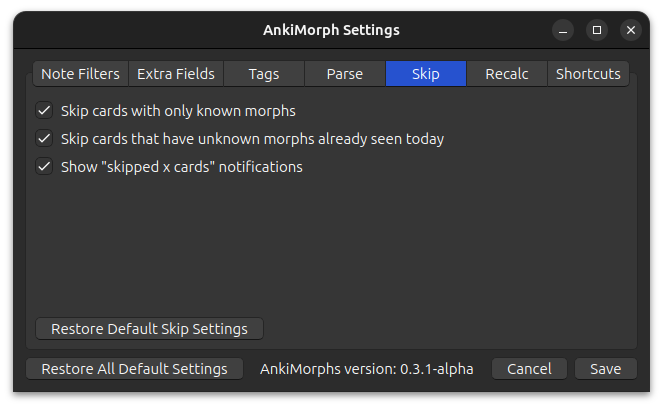

# Skip

This is where you can make AnkiMorphs really efficient. AnkiMorphs sorts
your cards based on how well you know its content; the more you know, the sooner the card will be shown. The downside is
this is that it might take a long time before you see a cards with any unknown morphs, i.e. you don't learn anything new.

To overcome this problem and speed up the learning process we can use the options found here.
