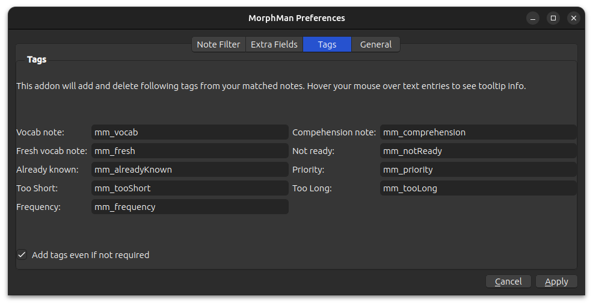

# Tags

As AnkiMorphs handles cards, it also automatically adds/removes various tags to those cards. You can customize the names
of the different tags if you want, or you can leave them as they are and move on.

> **Note:** Avoid reusing tags from other sources. Mixing different tags can quickly become complicated and confusing. 

* **One unknown morph**:  
  Cards that only have one unknown morph will be given this tag

* **Multiple unknown morphs**:  
  Cards that have more than one unknown morph will be given this tag
* **Fresh morphs**:  
  Cards that have one or more morphs in a `learning` state will be given this tag
* **Learn card now**:  
  When you use the [Learn Card Now](../../usage/browser.md) feature on a card, it will be given this tag. The purpose of
  this tag is to make the internal process of the `Learn Card Now` feature simpler. Don't give this tag to cards
  manually, nothing will happen.
* **Set known and skip**:  
  When you use the [Set known and skip](../../usage/reviewing-cards.md#encountering-morphs-you-already-know) feature on
  a card, it will be given this tag. Cards with this tag should not be deleted; AnkiMorphs might lose track of which
  morphs you know if you delete these cards.
* **All morphs known**:  
  New cards that only have morphs you already know will be given this tag. Cards with this tag can safely be deleted
  without AnkiMorphs losing track of which morphs you know. This can be useful if you want to trim down your card
  collection.

