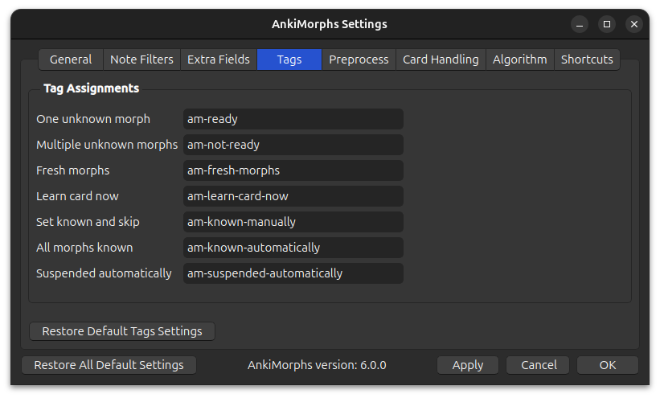

# Tags

As AnkiMorphs handles cards it also automatically adds/removes various tags to those cards. You can customize the names
of the different tags if you want, or you can just leave them as they are and move on.

* **One unknown morph**:  
  Cards that only have 1 unknown morph will be given this tag
* **Multiple unknown morphs**:  
  Cards that have more than 1 unknown morph will be given this tag
* **Learn card now**:  
  Cards you use the [Learn Card Now](../../usage/browser.md) feature on will be given this tag. The function of this tag
  is to makes the internal process of the `Learn Card Now` feature simpler--giving this tag to cards manually will do
  nothing.
* **Set known and skip**:  
  Cards you use [Set known and skip](../../usage/reviewing-cards.md#encountering-morphs-you-already-know) on will be
  given this tag. Cards with this tag should not be deleted; you might lose data which morphs you know if you delete
  these cards.
* **All morphs known**:  
  New cards that only have morphs you already know will be given this tag. Cards with this tag can safely be deleted
  without losing data which morphs you know. This can be useful if you want to trim down your card collection.

