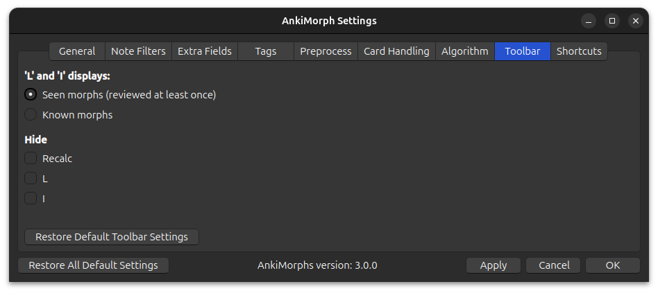

# Toolbar

Here you can adjust the look of the [toolbar](../../installation/changes-to-anki.md#toolbar), and which stats it shows.

**'L' and 'I' displays**:  
* **Seen morphs**:  
  Shows all morphs that have been reviewed at least once. This can be more motivating than only seeing known morphs 
  since it goes up every time you study new cards, but it can also give you a false sense of confidence.

* **Known morphs**:  
  Only show known morphs, which is determined by the general setting (todo: add link)

**Hide**:  
* **Recalc**:  
  `Recalc` will not be displayed in the toolbar

* **L**:  
  Known lemmas will not be displayed in the toolbar
* **I**:  
  Known inflections will not be displayed in the toolbar
