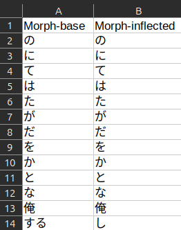

# Frequency File Generator


The Frequency File Generator creates a csv file (comma delimited) containing the morphs found in the selected files. The
morphs are placed in descending order based on frequency; the most frequent morph is on line 2, the 2nd most frequent
is on line 3, etc.



### Morph Collision

Inflected morphs can be identical even if they are derived from different bases, e.g:

```
Base : Inflection
有る    ある
或る    ある
```

To prevent misinterpretation of the inflected morphs we also store the base.

### Select Input
Select one or more files that you want to create the frequency file from. Selecting all files from a folder can be done
with Ctrl+A (Cmd+A).

### Select Output
The output file is automatically set to be `[anki profile folder]/frequency-files/frequency.csv`.

### Minimum Occurrence
You can limit the morphs to only those that occur at least this many times.

### Ignore
The 'ignore'-options are the equivalent to those found in ['Parse' settings](../setup/settings/parse.md).