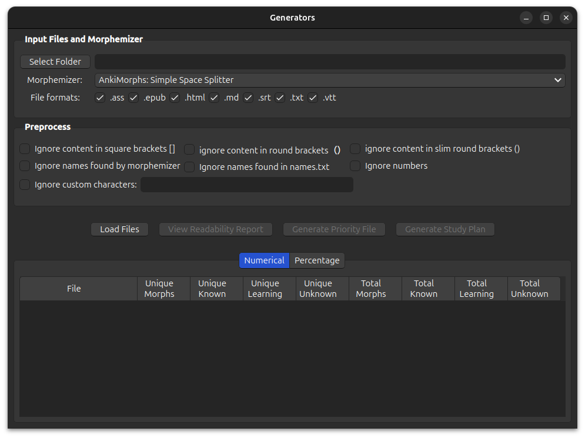
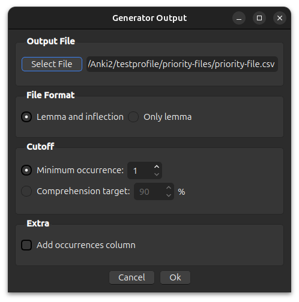

# Generators




AnkiMorphs provides the following three generators:

- [Readability Report Generator](#readability-report-generator)  
  A report over how well you know the text in the specified files

- [Priority File Generator](#priority-file-generator)  
  A file that lists all the found morphs sorted by their frequency  

- [Study Plan Generator](#study-plan-generator)  
  A combination of priority files in the order you specify

<br>

To use the generators you have to follow these three steps:
1. [Load input files](#loading-files)
2. [Select processing options](#processing-files)
3. [Select output options](#generator-output)

## Loading Files

### File Formats


These are the files that the generators are (mostly) able to read. Any files that don't have these extensions will be
ignored.

> **Note**:
> - Files must be encoded in `UTF-8`. Using other encodings may lead to parsing errors or crashes.
> - EPUB files may be parsed _slightly_ differently across operating systems due to system-specific quirks.

### Selecting Root Folder


Any files that match your selected file formats and are in this folder or sub-folders,
will be used by the generators.

Take, for example, the following folders and their files:

```
english_texts/
├── books/
│   └── The Wise Man's Fear/
│       ├── The Wise Man's Fear.pdf
│       └── The Wise Man's Fear.txt
└── subs/
    ├── Game-of-Thrones/
    │   └── season-1/
    │       └── episode_1.srt
    └── Lord_of_the_Rings/
        └── The_Fellowship_of_the_Ring.vtt

```

If you were to select the `books` folder, and you checked the `.txt` file format, then the generator would
only use the `The Wise Man's Fear.txt` file.

If you were to select the folder `english_texts` and you checked all the file format options, then the generator would
use the files:

- `The Wise Man's Fear.txt`
- `episode_1.srt`
- `The_Fellowship_of_the_Ring.vtt`

### After Loading


The files that will be used by the generators will be shown in the `File` column in the tables below, and the generator
buttons are now enabled. Next, you need to specify how the generators should [process the files](#processing-files).

## Processing Files

### Morphemizer


This is the tool AnkiMorphs uses to split text into morphs.

### Preprocess


These options are equivalent to those found in [`Preprocess` settings](../setup/settings/preprocess.md).

## Generator Output

When clicking the `Generate Priority File` or `Generate Study Plan` buttons you will be presented with these options:



The output file is automatically set to be in the [[anki profile folder](../../glossary.md#profile-folder)]`/priority-files/` folder. Any priority
files or study plans that are placed in this folder can be selected in the 
[note filter: morph priority settings](../setup/settings/note-filter.md#morph-priority).

You can name the file whatever you want as long as it has a `.csv` extension, e.g. `ja-freq.csv`.

### File Format

- `Lemma and inflection`: [inflection priority file](../setup/prioritizing.md#custom-inflection-priority-files)
- `Only lemma`: [lemma priority file](../setup/prioritizing.md#custom-lemma-priority-files)

### Minimum Occurrence

Limit the morphs to only those that occur at least `x` many times.

### Comprehension Target

Limit the morphs to only those that occur below the specified comprehension percent. Let's take these morphs as an example:


If your target is `90%`, then we get:

$$$ \large \text{Occurrence Sum Threshold} = 0.9 \times 400 = 360 $$$

The morphs in the fifth and sixth rows would therefore not be included since they have an occurrence sum greater than 360.

<br>
<br>

# Readability Report Generator

The Readability Report Generator can give you insights into how much of the text in a file you are able to read. It produces two
different outputs, one with pure numerical values, and one with percentages.


You can click on the column headers to sort the rows based on those values.

<br>
<br>

# Priority File Generator

The Priority File Generator creates a priority file that is described in the [prioritizing section](../setup/prioritizing.md).

<br>
<br>

# Study Plan Generator


Using a study plan is convenient if you want to learn morphs from source materials in a specific sequence,
e.g., TV show episodes, book series, etc.

A study plan differs from a regular priority file in the following ways:
- It is first sorted by input files, then morph frequency.
- It has extra columns:
    - Learning status
    - File name

The study plan generator basically does this:
1. Creates a priority file for each input file
2. Combines those priority files
3. Removes duplicate morphs

The resulting file can be used in the [note filter: morph priority settings](../setup/settings/note-filter.md#morph-priority)
like any other priority file.

> **Note**: that only the data from the `Morph-Lemma`, and `Morph-Lnflection` columns are read 
by AnkiMorphs, so you can delete or modify the other columns if you want.


### Changing The File Order

The study plan uses the same file order as that displayed in the currently opened table at the bottom of the window.
This provides more flexibility than relying solely on the alphanumeric values of the file names.

If I have this table open as I click the `Generate Study Plan` button:


Then the study plan will have the files in this order:
1. `Jigokuraku-03.srt`
2. `Jigokuraku-01.srt`
3. `Jigokuraku-02.srt`

> **Note**: the `Total` "file" is artificial and won't be included, nor is its data used in any calculations.

With this table open:


Then the order will be this:
1. `Jigokuraku-03.srt`
2. `Jigokuraku-02.srt`
3. `Jigokuraku-01.srt`
