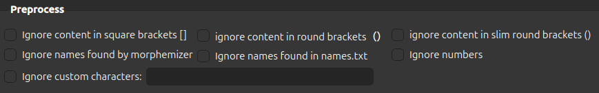

# Generators

AnkiMorphs provides two generators:

- [Frequency File Generator](generators/frequency-file-generator.md)
- [Readability Report Generator](generators/readability-report-generator.md)

They both have some options in common:

- [File formats](#file-formats)
- [Selecting input directory](#selecting-input-directory)
- [Parsing options](#parsing)

### File Formats


These are the files that the generators are (mostly) able to read. Any files that don't have these extensions will be
ignored by the generators.

### Selecting Input Directory


Any files that match your selected file formats and are in this folder or sub-folders,
will be used by the generator.

Take, for example, the following folders and their files:

```
english_texts/
    - books/
        - The Wise Man's Fear/
            - The Wise Man's Fear.epub
            - The Wise Man's Fear.txt
    - subs/
        - Game-of-Thrones/
            - season-1/
                - episode_1.srt
        - Lord_of_the_Rings/
            - The_Fellowship_of_the_Ring.vtt

```

If you were to select the `books` folder and you checked the .txt file format, then the generator would
only use the `The Wise Man's Fear.txt` file.

If you were to select the folder `english_texts` and you checked all the file format options, then the generator would
use the files:

- `The Wise Man's Fear.txt`
- `episode_1.srt`
- `The_Fellowship_of_the_Ring.vtt`

### Preprocess



The 'ignore'-options are equivalent to those found in ['Preprocess' settings](../setup/settings/preprocess.md).

