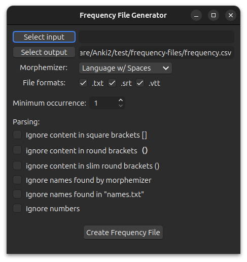

# Frequency File Generator



The Frequency File Generator creates a csv file (comma delimited) containing the morphs found in the selected files. The
morphs are placed in descending order based on frequency; the most frequent morph is on line 2, the 2nd most frequent
is on line 3, etc.


### Morph Collision

Inflected morphs can be identical even if they are derived from different bases, e.g:

```
Base : Inflection
有る    ある
或る    ある
```

To prevent misinterpretation of the inflected morphs we also store the bases.


### Select Output

The output file is automatically set to
be [[anki profile folder](../../glossary.md#profile-folder)]`/frequency-files/frequency.csv`. You can name it whatever you
want, e.g. `jp-freq.csv`, `chinese_hieroglyphs_frequencies.csv`, etc.

### Minimum Occurrence

You can limit the morphs to only those that occur at least this many times.

