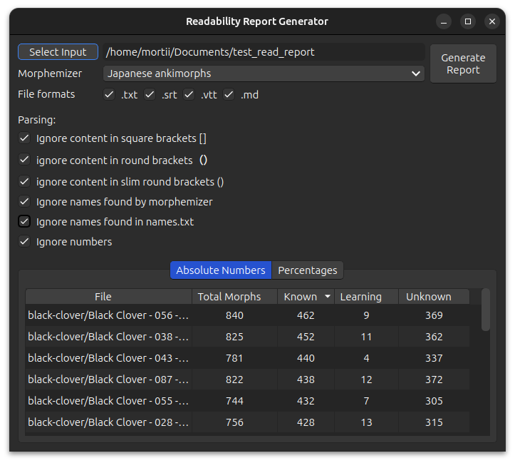

# Readability Report Generator

The Readability Report Generator can give you insights into how much of a file you are able to read. It produces two
different outputs, one with pure numerical values, and one with percentages.

