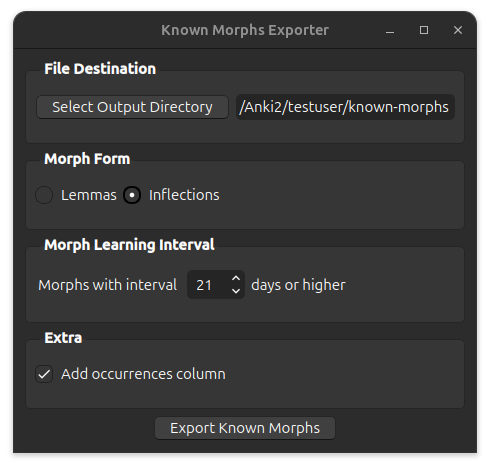

# Exporting Known Morphs



Exports all the morphs from ankimorphs.db that have the specified interval or above. Useful
for [setting known morphs](../setup/setting-known-morphs.md), which allows you to trim down your card collection.

### Select Output

Select the folder you would like AnkiMorphs to save the file to.

Defaults to the [[anki profile](../glossary.md#profile-folder)]`/known-morphs` folder.

### Resulting File

The file name will be `known_morphs-{datetime}.csv`, where datetime is the time of creation, e.g.:

```
known_morphs-2024-01-11@18-47-19.csv
```
The file format will be the same as those generated by the [frequency file generator](generators/frequency-file-generator.md).

