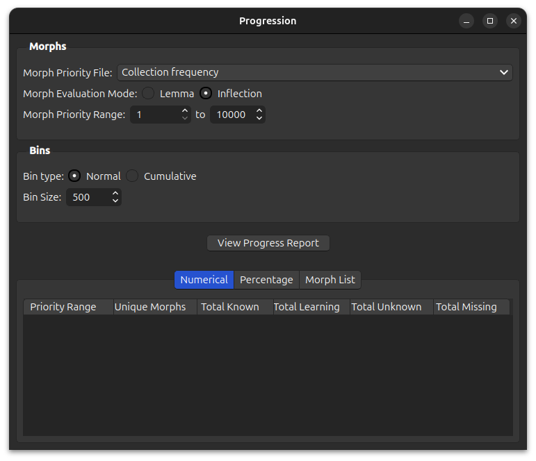

# Progression

In the beginning stages of language acquisition, your working vocabulary will consist mostly of commonly used words.
As your ability increases, you will recognize a richer variety of words. As you approach native-level proficiency,
you will recognize almost all words -- from the very common to the highly specialized. 

Although AnkiMorph cannot measure _true_ language acquisition, the Progression tool can help you understand both
your **learning progress** and the **quality of your card collection** with respect to morph priority.

## Setup

### Designating Morph Priorities

Since progression is measured with respect to [morph priorities](../setup/prioritizing.md), we must first decide how 
morph priorities should be determined. In an identical manner to [note filters](../setup/settings/note-filter.md#morph-priority), you can either use the morph 
frequencies of your card collection (`Collection frequency`) or you can designate a custom `.csv` file that contains this 
information. Any `.csv` file located in the folder [anki profile folder](../glossary#profile-folder)`/priority-files/` is available for selection. 

### Options

To gauge progression, AnkiMorphs essentially calculates a histogram. Morphs with assigned priorities are first binned
into priority ranges (e.g., priorities `1-500`, `501-1000`, etc.). 

The user can designate the bin size:

as well as the minimum and maximum priority considered:

> **Note**: the calculated bins may differ depending on the number of specified morph priorities.  

Bins can also be cumulative:

In this mode, bin statistics will increase or decrease monotonically.

Finally, the user can specify whether morphs should be evaluated according to [lemma or inflection](../glossary.md#morph).

This can be freely changed regardless of the mode specified in the [general settings](../setup/settings/general.md). However, if using
morph priorities from a custom `.csv` file, one must be sure as always that the file is compatible with the morph evaluation mode, e.g. 
if you are using a [lemma-only priority file](../setup/prioritizing.md#custom-lemma-priority-files), then you can only evaluate by lemma.

## Results

Clicking `View Progress Report` will determine the current progression and populate the results. 

### Numerical and Percentage Tabs

The `Numerical` tab reports the number of unique morphs, known morphs, learning morphs, unknown morphs, and missing morphs in each priority range (bin). Unknown morphs are present in the card collection, while missing morphs are not present in the card collection.

The `Percentage` tab reports these same statistics as percentages of unique morphs. By examining the percentage of known morphs, **learning progress** can be evaluated. Meanwhile, the percentage of missing morphs is an important metric of **card collection quality** -- a deck should contain the most relevant morphs, after all. 

### Morph List Tab

The `Morph List` tab provides the status of each morph with a specified priority. This information can be useful to quickly zero-in on critical morphs that are either unknown or missing from your card collection.

