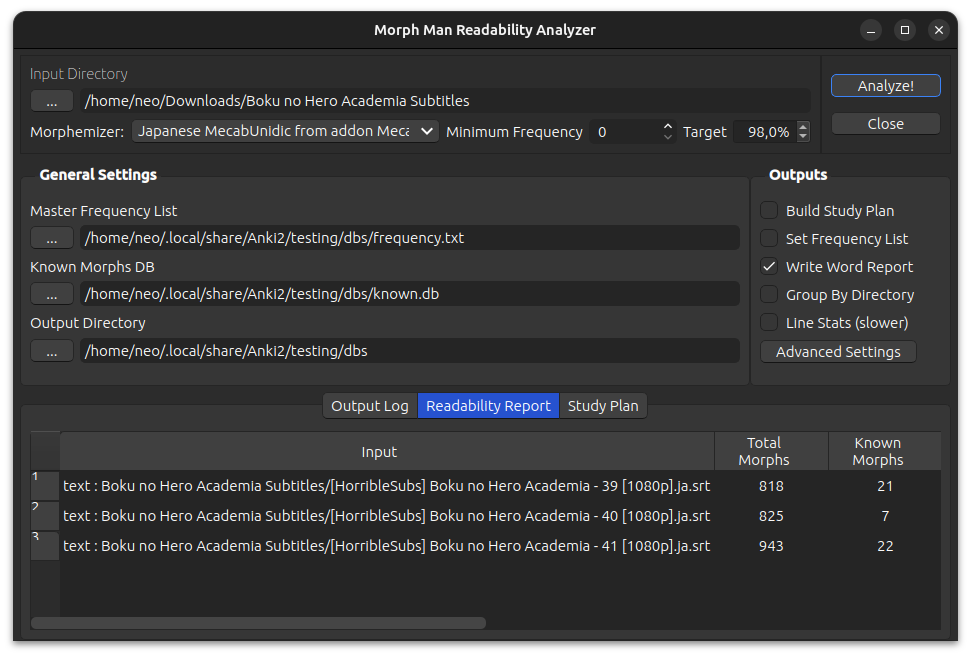

# Readability Analyzer

MorphMan’s Readability Analyzer allows users to run various statistical analyses on the words contained within target
language texts. You can access it by going to “Tools > MorphMan Readability Analyzer” on Anki’s main page.

When inputted target-language text, the Readability Analyzer has the ability to do four things:
* **Readability Report**:  
  Tell you what percentage of words contained in the text you already know (or to be exact, what
  percentage of the words are considered Mature Morphs in your MorphMan database). The Readability Report is outputted
  within the “Readability Analyzer” window. Whether the “Readability Report” box is checked off doesn’t change anything
  in the current version of MorphMan.
* **Word Report**:  
  Outputs a list of all the words contained within the text, along with various information such as their
  part of speech and number of occurrences within the text. Outputted in the form of a text file placed in the “Output
  Directory”.
* **Target Study Plan**:  
  Outputs a list of the words, ordered by frequency, that you would need to learn to reach the
  “Target %” percentage of known words contained within the text. Outputted in the form of a text file placed in the
  “Output Directory”.
* **Frequency List**:  
  Outputs a frequency list that can be used as your [frequency.txt](../setup/prioritizing.md). Outputted in
  the form of a text file
  placed in the “Output Directory”.

In order to use the Readability Analyzer, first select your “Input Directory”. The Readability Analyzer will analyze all
files contained within the folder you specify as your input directory. You can have it analyze a single file, or
multiple files at once. It supports .txt, .ass, and .srt files encoded in UTF-8. This means you can easily analyze the
subtitle files for a show, which can be very useful. Then load up your known.db (which should be done automatically) and
select where you want the results outputted, and press “Analyze!”.

If you load a “Master Frequency List” (formatted in the same format as the “Word Report), when generating a “Target
Study Plan” and “Frequency List”, results from the files in the “Input Directory” will be combined with the Master List.
For the “Target Study Plan”, adding a master list will change the order that the words are listed in and which words are
left off the list; the words that appear in the list will come solely from the “Input Directory”. Using a “Master
Frequency List” is entirely optional.
