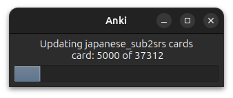
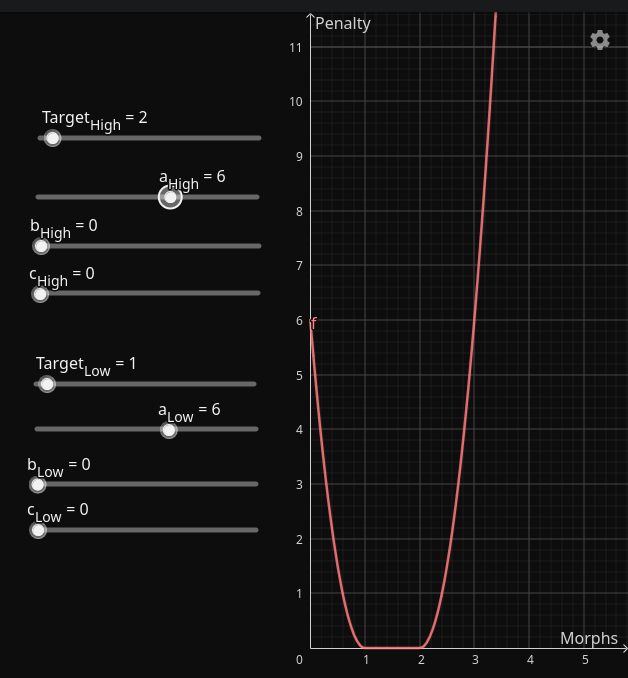
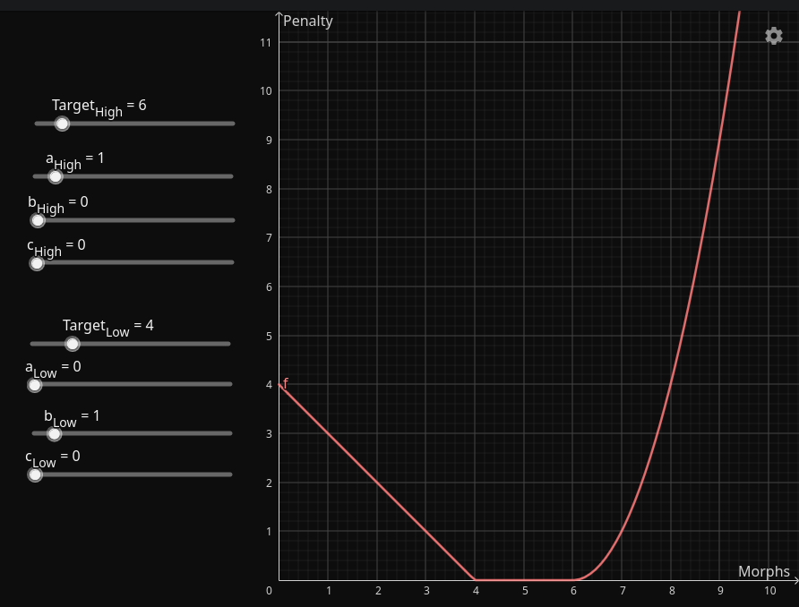

# Recalc

Recalc is short for “recalculate”, and is basically the command that tells AnkiMorphs to work all its
magic. When you run Recalc, AnkiMorphs will go through
the [cards that match any 'Note Filter'](../setup/settings/note-filter.md) and do the following:

* Update the `ankimorphs.db` with any new seen morphs, known morphs, etc.
* Calculate the [score of the cards](#scoring-algorithm), and then sort the cards based on that score.
* Update any cards' [extra fields](../setup/settings/extra-fields.md) and [tags](../setup/settings/tags.md).

Basically, when you run Recalc, AnkiMorphs will go through your collection, recalculate
the difficulty of your cards based on your new knowledge, and reorder your new cards in a way that’s optimal for the new
you: the you who knows more than you did yesterday.

You can run Recalc as often as you like, but you should run it at least once before or after every study session so that
your new cards will appear in the optimal order.

It's easy to forget to run recalc, so you can also
check the [`Recalc on sync` settings option](../setup/settings/recalc.md), which will take care of recalc for you by
running it automatically before Anki syncs your collection.

> **Note**: Recalc can potentially reorganize all your cards, which can cause long sync times.
> The [Anki FAQ](https://faqs.ankiweb.net/can-i-sync-only-some-of-my-decks.html) has some
> tricks you can try if this poses a significant problem.

## Scoring Algorithm (todo: remove)

Low scores are good, high scores are bad; the more comprehensible and important a text is evaluated to be, the lower the
score will end up being.

The algorithm is as follows:

$$$ \large \text{Score} = U_n \times U_p + \sum_{m \in M}{m_p} $$$

where
$$$
\begin{align*}
& U_n = \text{The number of unknown morphs} \\
& U_p = \text{Unknown morph penalty} = 5 \times 10^5\\
& M = \text{The set of morphs}\\
& m_p = \text{The priority given to morph } m\\
\end{align*}
$$$

Note that the sum of [morph priorities](../setup/prioritizing.md) is capped to be less than the unknown morph penalty,
which gives us the inequality:

$$$ \large 0 \le \left(\sum_{m \in M}{m_p}\right) < U_p $$$

This makes sure that one unknown morph is calculated to be more difficult than any number of known rare morphs.

## (new) Scoring Algorithm (very rough draft)

$$$
\large \text{score} = \min \left(PU \times \left| M_{\text{U}} \right| + \text{tuning},\  \text{score}_{\text{max}} \right)
$$$

where
$$$
{\large
\begin{align*}
& \min: \text{choose the side with the lowest value} \\
& PU: \text{penalty for unknown} = 10^6\\
& M: \text{set of identified morphs} \\
& m_{\text{li}}: \text{morph learning interval} \\
& M_U: \text{unknown morphs} = \{ m \in M \mid m_{\text{li}} = 0 \} \\
& \text{tuning}: \text{scalar product of priorities and their weights}\\
& \text{score}_{\text{max}}: \text{signed 32-bit int max and some leeway} = 2^{31} - 1 - 10^8\\
\end{align*}
}
$$$

## Tuning

$$$
\large \text{tuning} = \min \left(W \cdot P,\  PU - 1\right)
$$$

$$$
W \cdot P = w_1 p_1 + w_2 p_2 + \cdots + w_n p_n = \sum_{i=1}^{n} w_i p_i
$$$

Let $$\mathbf{W}$$ be the column vector of weights and $$\mathbf{P}$$ be the column vector of priority terms:

 

$$$
{\large
\mathbf{W} = \begin{pmatrix}
\begin{array}{l}
W_{\text{total}}^{\text{all}} \\[10pt]
W_{\text{total}}^{\text{unknown}} \\[10pt]
W_{\text{total}}^{\text{learning}} \\[10pt]
W_{\text{average}}^{\text{all}} \\[10pt]
W_{\text{average}}^{\text{learning}} \\[10pt]
W_{\text{target}}^{\text{all}} \\[10pt]
W_{\text{target}}^{\text{learning}} \\[10pt]
\end{array}
\end{pmatrix}
\quad
\mathbf{P} = \begin{pmatrix}
\begin{array}{l}
P_{\text{total}}^{\text{all}} \\[10pt]
P_{\text{total}}^{\text{unknown}} \\[10pt]
P_{\text{total}}^{\text{learning}} \\[10pt]
P_{\text{average}}^{\text{all}} \\[10pt]
P_{\text{average}}^{\text{learning}} \\[10pt]
D_{\text{target}}^{\text{all}} \\[10pt]
D_{\text{target}}^{\text{learning}} \\[10pt]
\end{array}
\end{pmatrix}
}
$$$

### Priorities

$$$
{\large
\begin{align*}
& P = \text{priority}  \\
& W = \text{weight} \\
& m_{\text{p}}: \text{morph priority} \\
& M_{\text{L}} = \{ m \in M \mid 0 < m_{\text{li}} < \text{known threshold} \} \\
\end{align*}
}
$$$

$$$
{\Large
\begin{array}{ccc}
\begin{aligned}
\\[15pt]
P_{\text{total}}^{\text{all}} &= \sum_{m \in M}{m_p} \\[30pt]
P_{\text{total}}^{\text{unknown}} &= \sum_{m \in M_{\text{U}}}{m_p} \\[30pt]
P_{\text{total}}^{\text{learning}} &= \sum_{m \in M_{\text{L}}}{m_p} \\
\end{aligned}
&
&
\begin{aligned}
\\[1pt]
P_{\text{average}}^{\text{all}} &= \frac{P_{\text{total}}^{\text{all}}}{\left| M \right|} \\[20pt]
\\[25pt]
P_{\text{average}}^{\text{learning}} &= \frac{P_{\text{total}}^{\text{learning}}}{\left| M_{\text{L}} \right|} \\
\end{aligned}
\end{array}
}
$$$

### Target number of morphs

 

$$$
{\large
D_{\text{target}}^{\text{all}} =
\begin{cases}
a_H (|n - T_H|^2) + b_H |n - T_H| + c_H & \text{if } n > T_H \\
a_L (|n - T_L|^2) + b_L |n - T_L| + c_L & \text{if } n < T_L \\
0 & \text{otherwise}
\end{cases}
}
$$$

 

$$$
{\large
D_{\text{target}}^{\text{learning}} =
\begin{cases}
a_H (|n_L - T_H|^2) + b_H |n_L - T_H| + c_H & \text{if } n_L > T_H \\
a_L (|n_L - T_L|^2) + b_L |n_L - T_L| + c_L & \text{if } n_L < T_L \\
0 & \text{otherwise}
\end{cases}
}
$$$

where
$$$
{\large
\begin{align*}
& D_{\text{target}}: \text{target difference} \\
& T_H: \text{high target} \\
& T_L: \text{low target} \\
& n: \text{number of morphs} = \left| M \right|\\
& n_L: \text{number of learning morphs} = \left| M_{\text{L}} \right| \\
& a_H, b_H, c_H : \text{coefficients when \( n \) or \( n_L \) is greater than \( T_H \)} \\
& a_L, b_L, c_L : \text{coefficients when \( n \) or \( n_L \) is less than \( T_L \)} \\
\end{align*}
}
$$$

playground: [https://www.geogebra.org/graphing/ta3eqb8y](https://www.geogebra.org/graphing/ta3eqb8y)

learning target:

all target:

