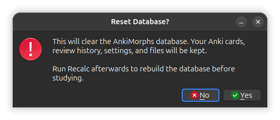

# Reset Database

If you suspect the cached morph data is incorrect, go to `Tools` -> `AnkiMorphs` ->
`Reset Database` and confirm the reset. This clears the AnkiMorphs database, including
cached morphs and today's seen morphs. Your Anki cards, review history, settings,
known-morphs files, and priority files are kept.

Run [Recalc](recalc.md) afterwards to rebuild the database before studying.
The first recalc after a reset extracts morphs from all cards included by your read-enabled note filters.
