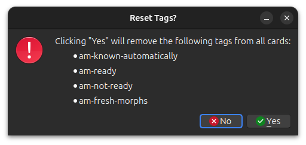

# Reset Tags

When you switch to a new morphemizer or change the [morph evaluation](../setup/settings/general.md) from lemma to
inflection, some tags on your cards may become incorrect or misleading and these should be removed. The tags shown in
the picture above are safe to remove because they will always be reapplied during recalc.

To reset these tags, go to `Tools` -> `AnkiMorphs` -> `Reset Tags`