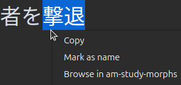

# Reviewing Cards

### Starting Out

When you first start using AnkiMorphs, you will probably come across many variations of Interjections (e.g. `Aaah!`,
`umm...`, `Wow!`) and other uninteresting
words. [Just tag them as known](reviewing-cards.md#encountering-morphs-you-already-know)
and move on. When you reach a critical mass of known morphs, usually around 50–100, is when you will start encountering
useful sentences.

Stuttered names or words might accidentally produce morphs that don't make any sense in the context, and you should
probably suspend these cards or mark them as known if there are many of them.

AnkiMorphs might seem error-prone at first, like mixing up two (seemingly) different morphs, but the more data it
accumulates, the more accurate it becomes, so try not to get discouraged! It becomes much more enjoyable to use after
you know 100+ morphs.

It is a good idea to frequently [Recalc](recalc.md) when you are first starting out, maybe every 10 cards or so,
to make sure you get the best possible new cards.

### Encountering Morphs You Already Know

If you already know the morphs in a card you are presented, then use the hotkey `K` (for Known) to add
the `am-known-manually` tag to the card and skip it. The morphs on this card will be considered known the next time you
recalc.

### Encountering Cards You Don't Understand

There will also be times when AnkiMorphs says a card is [1T](../glossary.md#1t-sentence), but you aren’t able to
understand it. There are two reasons this may occur. The first is that, due to incorrect parsing, AnkiMorphs thinks you
know a word that you don’t. Unfortunately, there is no easy way to remove morphs from the AnkiMorphs' database. Luckily,
this shouldn’t happen very often. When it does, your only real option is to suspend or delete the card.

The other scenario is that you aren’t able to understand a sentence deemed 1T despite it indeed
containing only one unknown morph. This is simply a fact of life when it comes to language learning. Sometimes you know
all the words in a sentence, but still just can’t get what it means. It could be due to many things, such as one of the
words having an alternate meaning you haven’t learned yet, or the grammar being too tricky for you to parse at your
current level. Basically, although the sentence appears to be 1T, it’s actually [MT](../glossary.md#mt-sentence). By
definition,
any sentence that’s truly 1T shouldn’t be difficult to understand.

Whenever this happens, it's best to either [find a better card](reviewing-cards.md#finding-a-better-card) or
suspend/delete theccard and move on. The whole point of AnkiMorphs is to help you make fast progress by collecting
low-hanging fruit. If you spend time mulling over things that are above your level, you’re defeating the purpose of the
add-on.

### Finding A Better Card

<video autoplay loop muted controls>
    <source src="../../img/learn-now.mp4" type="video/mp4">
</video>


If you want to learn a different card instead of the one you are presented, then press the hotkey
`L` to open the browser and see all the other [1T](../glossary.md#1t-sentence) cards in your collection with the same
unknown morph. If you want to see all 1T _and_ [MT](../glossary.md#mt-sentence) cards you can use `Shift+L`.

From here you can right-click your preferred card and select `Learn Card Now`. You can also find the same options in
the `AnkiMorphs` menu at the top of the browse window.

The card will then go to the top of the `new cards`-queue. If you have other due cards, then they might show up first.


### Encountering Suitable 1T Cards

If you come across a new card with only one unknown and it seems reasonable, treat it like any other new Anki card and
answer it accordingly. For more information on handling new cards,
refer to the [Anki studying guide](https://docs.ankiweb.net/studying.html#learningrelearning-cards).


### Skipping Cards

There are three scenarios where AnkiMorphs will automatically skip a card:

1. **You have selected the `Skip cards with only known morphs`-option the in the [card-handling settings](../setup/settings/card_handling.md)**:   
   If the next card has one of the ['known' tags](../setup/settings/tags.md), then it will be skipped.

2. **You have selected the `Skip cards that have unknown morphs already seen today`-option
   in the [card-handling settings](../setup/settings/card_handling.md)**:   
   Say you have three cards: `card1, card2, card3`, all of which have the same unknown morph. After you have
   answered `card1` then the cards `card2, card3` will be skipped.

3. **You have selected the `ignore names found in names.txt`-option in [preprocess settings](../setup/settings/preprocess.md)**   
   Let's use the same example of three cards , `card1, card2, card3`. This time they all have the same unknown morph
   `Alexander`. If you use the [Mark as name](../setup/names.md) feature to mark `Alexander` as a name on `card1`,
   then the cards `card2, card3` will be skipped.

### Pre-skipping Cards

The skipping features mentioned in the section above only take effect when using Anki on desktop where the AnkiMorphs
addon is activated. This can make it tricky to study new cards on mobile since there might be many cards right after
each other that have the same unknown morph.

To get some of the same effects on mobile, we can instead "pre-skip" cards by selectively moving some of them
farther back in the queue when we Recalc.

For more info read:

[Card Handling: Shift new cards that are not the first to have the unknown morph](../setup/settings/card_handling.md)

### Right-Clicking Highlighted Text



AnkiMorphs adds some additional options to the Anki context menu (right-click):

* **Mark as Name**:  
  The highlighted text will be added to the [names.txt](../setup/names.md) file, and the card will be skipped.

* **Browse in `am-study-morphs`**:  
  This opens up the Anki Browse window with the search term:
  ```
   "am-study-morphs:{highlighted_text}"
  ```
  This can be useful for finding cards you previously studied that contained the highlighted text as an unknown morph.

  For example, you might have forgotten the nuances of the word `repulse`, but recall having studied it before, you can
  then highlight `repulse`, select this option, and the browse window will open with the search term:
  ```
   "am-study-morphs:repulse"
  ```