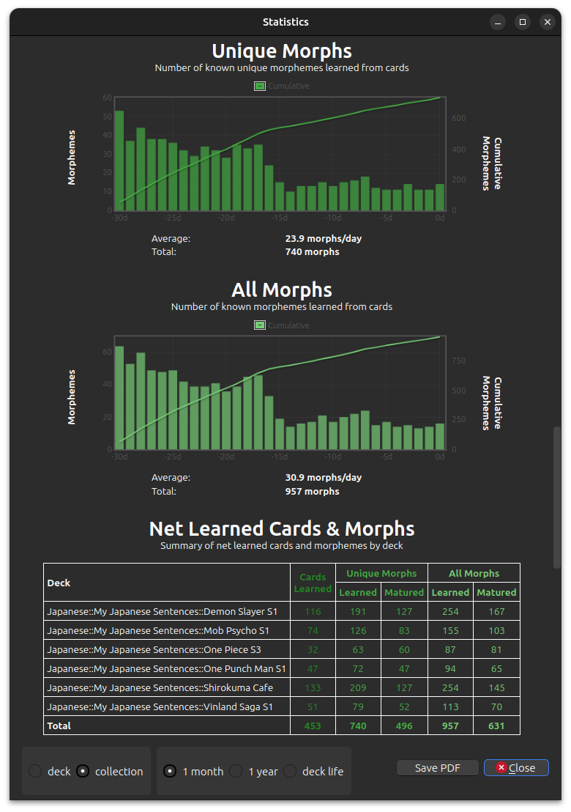

# Statistics

To see the stats shown above you need to press down the "Shift" key while clicking the "Stats" button in Anki. Then scroll
down in the "Statistics" window and towards the bottom you will find morph stats. 